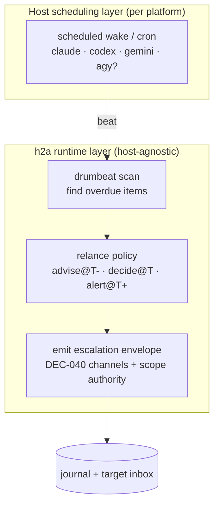

# Drumbeat — timed relances & escalation (specification & plan)

> Time-based **follow-ups (relances) and escalation** for crisis/escalation management: when an h2a commitment is overdue or a response is awaited past a deadline, relance then escalate to the scope's competent authority. **Status: planned (not built).** Priority workstream. Decision: DEC-083.

## Problem

h2a today has the *channels* for escalation (`advise` / `decide` / `alert` + scope-authority resolution, DEC-040) and *liveness* heartbeats (presence/session, 5s/15s, DEC-050/051), but **nothing time-driven** ties a commitment's deadline to an escalation. There is no "if no signature/ack/response within T, remind, then escalate" — the core of follow-up and crisis management.

The `drumbeat` is that missing timer layer: a periodic beat that detects overdue items and drives the relance → escalation sequence, reusing the existing escalation channels.

## Two layers

1. **Runtime layer (host-agnostic, in `@sentropic/h2a-cli`)** — deadlines/SLA on commitments + a scanner that detects overdue items and emits escalation envelopes. Pure timer/decision logic in core.
2. **Host scheduling layer (per platform)** — each host needs a way to *wake the agent on a timer* to run the scan. This is the "plugin per platform" part.

## Specification (runtime layer)

### Deadlines & relance policy

- A commitment (`ENGAGEMENT`, an awaited `inbox` envelope, or a `NEGOTIATION` with `deadline`) may carry a **relance policy**: `{ adviseAt, decideAt, alertAt }` (absolute or relative to a `deadline`), mapping elapsed time to an escalation **channel** (DEC-040: `advise` → `decide` → `alert`).
- `H2ADrumbeatState = "on-time" | "advise-due" | "decide-due" | "alert-due"` derived from `(deadline/policy, now)` — a **pure** function `computeDrumbeatState(item, now)`. No I/O.

### Scanner

- `scanDrumbeat(store, now)` → list of overdue items + the escalation each should emit (target authority resolved by scope, DEC-040). Reuses the presence-scanner shape (DEC-052).
- For each overdue item, emit an **escalation envelope** to the scope's competent authority's inbox + append a journal event (so relances are auditable and idempotent — don't double-fire the same channel).

### Surfaces

- CLI: `h2a drumbeat scan --root 
` (one-shot: report + emit), and optionally `h2a drumbeat watch` (loop).
- MCP tool: `h2a_drumbeat` so a connected agent can run the beat in-session.
- Skill: `/h2a drumbeat` subcommand.

### Reuses (no new auth/transport)

Escalation channels + scope-authority resolution (DEC-040), the journal (idempotent relance ledger), recurring-obligation cadence profiles (DEC-047) for default timings, signed envelopes (DEC-073) for cross-host escalation, controlled disclosure (DEC-045) for what the alerted authority sees.

## Host scheduling layer (the "plugins")

Each host must wake the agent on a timer to run the scan. Current h2a host integration = `/h2a` skill + MCP, for **claude / codex / gemini** (DEC-054/055).

| Platform | Scheduling primitive | h2a host today |
|---|---|---|
| claude (Claude Code) | scheduled wake-up / cron (the `/loop` mechanism) | ✅ supported |
| codex | cron / scheduled task (TBD per CLI) | ✅ supported |
| gemini | cron / scheduled task (TBD per CLI) | ✅ supported |
| **agy** | TBD | **❌ not a supported host** |

> **Open decision**: the user's three target platforms are **agy / claude / codex**, but h2a's third host is **gemini**, not agy. Either add an `agy` host descriptor (skill + MCP snippet, mirroring DEC-055) or confirm the target set. This blocks the host-layer slices for agy.

## Plan (ordered slices)

| Slice | Deliverable | Layer | Depends on |
|---|---|---|---|
| **D1** | relance-policy + `computeDrumbeatState` (pure) | core | DEC-040, DEC-047 |
| **D2** | `scanDrumbeat` + `h2a drumbeat scan` + MCP tool: detect overdue → emit escalation (idempotent via journal) | cli runtime | D1, DEC-040 |
| **D3** | host scheduling glue + `/h2a drumbeat` skill subcommand (claude/codex/gemini) | skill/host | D2, DEC-055 |
| **D4** | crisis mode: aggregated alert fan-out + per-authority batching | cli runtime | D2 |
| **D0?** | `agy` host descriptor (if agy is a confirmed target) | host | DEC-055 |

## Open questions

1. Which items carry a deadline/relance policy — `ENGAGEMENT` only, or also awaited envelopes / negotiations?
2. Relance idempotency: one escalation per channel per item (journal-guarded) — confirm semantics.
3. Per-host scheduling primitives for codex / gemini (and agy) — do their CLIs expose a cron/wake hook like Claude Code's?
4. **agy as a host** — add it, or is the third platform gemini after all?
5. Default timings — derive from a recurring-obligation profile (DEC-047) or per-engagement explicit?

## Related

- DEC-040 (escalation channels + scope authority), DEC-047 (recurring-obligation cadence), DEC-050/051 (presence/session heartbeat), DEC-052 (notification scanner), DEC-054/055 (host skill + MCP), DEC-083 (this plan).
