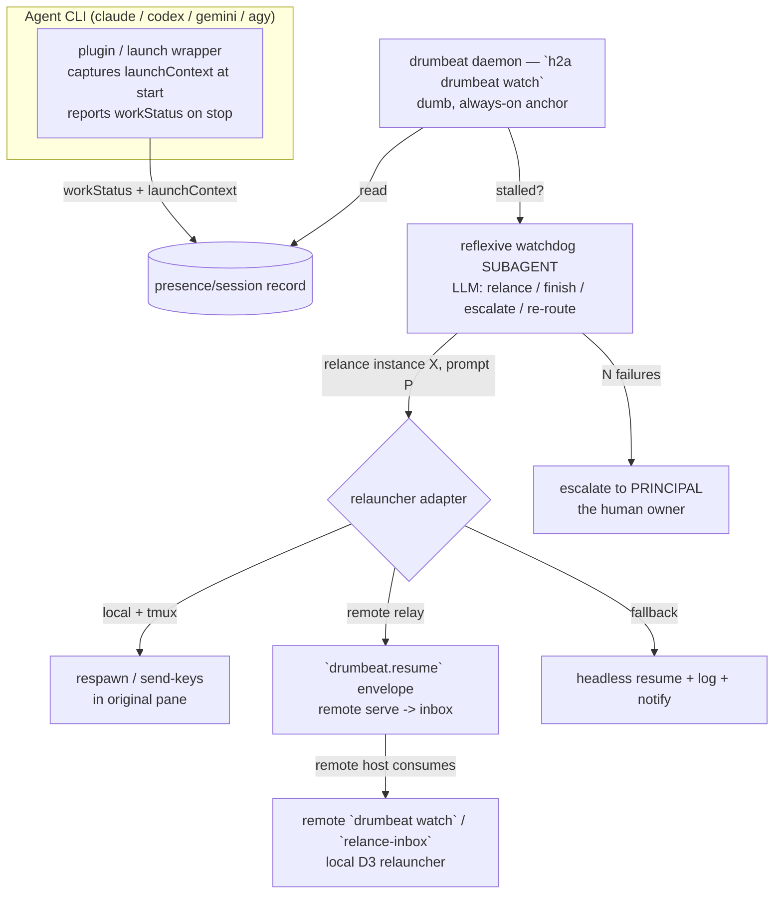

# Drumbeat — anti-stall relance & escalation (specification)

> Keep agent work **moving**: detect when a CLI agent has stalled (stopped without a real reason after a work sequence, or run out of tokens) and **relance** it; escalate to the owner when auto-relance fails. **Status: specified, not built.** Priority workstream. Supersedes the framing of DEC-083; recorded in DEC-084.

## Problem (the real motivation)

CLI agents frequently **stop without finishing** after a work sequence; sometimes they run **out of tokens**. The cost is wasted wall-clock time. The deadline/SLA angle matters too, but it is secondary (layer 2).

Crucially, **codex / agy / gemini have no `/loop`-style mechanism at all** — only Claude Code has one, and that one is a **self-wake** (the agent re-schedules itself), which **cannot recover an agent that has already exited or exhausted its tokens**. So the relance must be driven **from outside** the agent, uniformly across platforms. The drumbeat is that missing **external loop**.

## Architecture

**Separation of concerns** (the load-bearing design):

1. **Detection — host-agnostic, in the presence layer.** Two additions to the presence/session record (DEC-050/051):
   - `workStatus`: `working | paused | done | blocked | out-of-tokens`.
   - `launchContext`: `{ tmux?: {session, window, pane}, tty?, cwd, command, resumeCommand }` — **captured at launch** by the plugin/wrapper (it cannot be inferred later: a shell that did not launch the session cannot find its tmux pane). 
   - Reported by the **per-CLI plugin** when it can (precise); a **heuristic** fallback infers stall = *presence idle + engagement not `done` + no new journal entry for T*.

2. **The drumbeat daemon (`h2a drumbeat watch`) — the external loop, dumb and always-on.** It is the anchor that never stalls (a plain process/cron, no LLM). It reads `workStatus`, detects stalls, and triggers a relance. This is the `/loop` that codex/agy/gemini lack, and a more robust one for Claude (external, not self-wake).

3. **Relauncher adapters — environment-specific** (the daemon decides *"relance X with prompt P"*; the adapter performs the spawn):
   - **local-tmux (priority)**: re-inject into the **original tmux pane** (`respawn-pane` / `send-keys` the resume command — `codex resume`, `agy -c`, `gemini -r`, `claude -r`) using the captured `launchContext` → the user sees it resume in place.
   - **remote relay**: sign and POST a `drumbeat.resume` envelope to the target instance's declared `endpoints[{kind:"remote"}].uri`; the remote transport only delivers to inbox, and the remote host then consumes the inbox and relances locally with its own D3 adapters.
   - **headless fallback**: original terminal gone → spawn headless (`-p`/resume) detached, log output, **notify the PRINCIPAL**.

4. **Reflexive function — a watchdog SUBAGENT (LLM, DEC-068).** Invoked by the daemon to *decide*: relance with what nudge / mark `done` / escalate / **re-route** (e.g. switch model when out-of-tokens). It is a *function*, not a new frozen role; it can also watch the conductor. The dumb daemon is the anchor that calls it (no recursion).

5. **Escalation chain.** `AGENTS ← CONDUCTOR ← PRINCIPAL` (the engagement's executive-function owner — **often the human who launched the session locally**). After **N failed relances**, escalate to the **PRINCIPAL** (human), not EXECUTIF. EXECUTIF only enters at a federated/umbrella scope. Anti-loop: cap relances per item, journal-guarded (idempotent).

## Plan (ordered slices)

| Slice | Deliverable | Layer |
|---|---|---|
| **D1** | ✅ **done (DEC-085, 0.4.0)** — presence `workStatus` + `launchContext` fields + pure `inferStall` (core) + `updatePresence` patch (cli) | core + cli store |
| **D2** | ✅ **done (DEC-086, 0.5.0)** — durable registry (`recordStop`/`listDrumbeat`/`clear`/`markRelanced`) + `scanDrumbeat` + `drumbeatTick`/`runDrumbeatWatch` + `H2ARelauncher` adapter interface + `h2a drumbeat record/scan/clear/watch` | cli runtime |
| **D3** | ✅ **done (DEC-091, 0.10.0)** — `localTmuxRelauncher` (send-keys the resume/launch command into the captured pane) + `headlessRelauncher` (detached respawn + notify) + `chainRelauncher` (tmux→headless), injectable `RelauncherRuntime`; `h2a drumbeat watch --relauncher logging\|local-tmux\|headless\|auto` | cli runtime |
| **D4** | ✅ **done (DEC-117, unreleased)** — Option A relay chain: `remoteRelauncher` signs `drumbeat.resume` and POSTs it with `sendRemoteEnvelope`; `relanceFromInbox` / `h2a drumbeat relance-inbox` consume delivered resumes and relance locally with D3 adapters; `h2a drumbeat watch --relauncher remote` and `auto = local-tmux → remote → headless` require `--instance` + `--private-key`. The remote serve path remains a pure delivery sink. | cli runtime + remote transport |
| **D5** | reflexive watchdog SUBAGENT (decide relance/finish/escalate/re-route) | skill/subagent |
| **D6** | ✅ **done (DEC-093/096/101/102/103/104/113)** — `h2a host plugin` renders the per-host stop-hook (4 hosts at parity); **`--write` installs it for claude + gemini + codex** (Claude-format `hooks.Stop`; codex → a plugin `hooks.json`); **`--scaffold <dir>` (codex-only) writes codex's full local marketplace** — `.agents/plugins/marketplace.json` + `plugins/<name>/.codex-plugin/plugin.json` + `plugins/<name>/hooks/hooks.json` (verified live: codex installs from a marketplace dir, not a bare plugin) — and emits the **trust step** (`codex plugin marketplace add <dir>` → `codex plugin add h2a-drumbeat@h2a-local`) in the `trust` array; agy parity (MCP + scenario + install-skills + poll, no daemon). claude/gemini/codex are installable as close to one-shot as each trust model allows; agy polls. | host plugins |
| **D7** | ✅ **done (DEC-095, unreleased)** — durable escalation registry + `h2a drumbeat watch` auto-escalates an exhausted agent to the PRINCIPAL (channel `alert`); `h2a drumbeat escalations` lists open alerts; `drumbeat clear` closes them. Anti-loop cap = `--max-relances`. Target resolution is symbolic (reversible, see loop-decisions). | cli runtime |
| **L2** | deadline/milestone layer (relance as an engagement deadline approaches) | later |

Reuses: presence/session (DEC-050/051), escalation channels (DEC-040), subagents (DEC-068), signed envelopes (DEC-073), the journal (idempotent relance ledger). agy is a host (EVO-0; supports MCP).

## Open questions (for the build)

1. **Token re-routing** policy on `out-of-tokens`: wait/retry, switch model, or escalate to human — per-engagement or global?
2. Heuristic stall thresholds (idle time T, "no journal progress" window) — defaults + per-engagement override.
3. Per-CLI **stop-hook** availability: can each plugin reliably emit `workStatus` on exit? (claude hooks/settings; gemini `hooks`; codex `app-server`; agy — TBD, captured by EVO-1 matrix.)
4. How the daemon **authenticates** to relaunch / who runs it (local: started by the user once; cloud: by remote).
5. Does the local-tmux adapter `send-keys` (gentler) or `respawn-pane` (cleaner) — likely `send-keys` to preserve scrollback.

## Related

DEC-040 (escalation), DEC-050/051 (presence/session), DEC-052 (notification scanner), DEC-068 (subagents), DEC-059/063 (remote bridge), DEC-083 (initial framing, superseded), DEC-084 (this spec), `docs/plugin-capability-matrix.md` (per-CLI hooks), `docs/evolution-intentions.md` (EVO-2).
