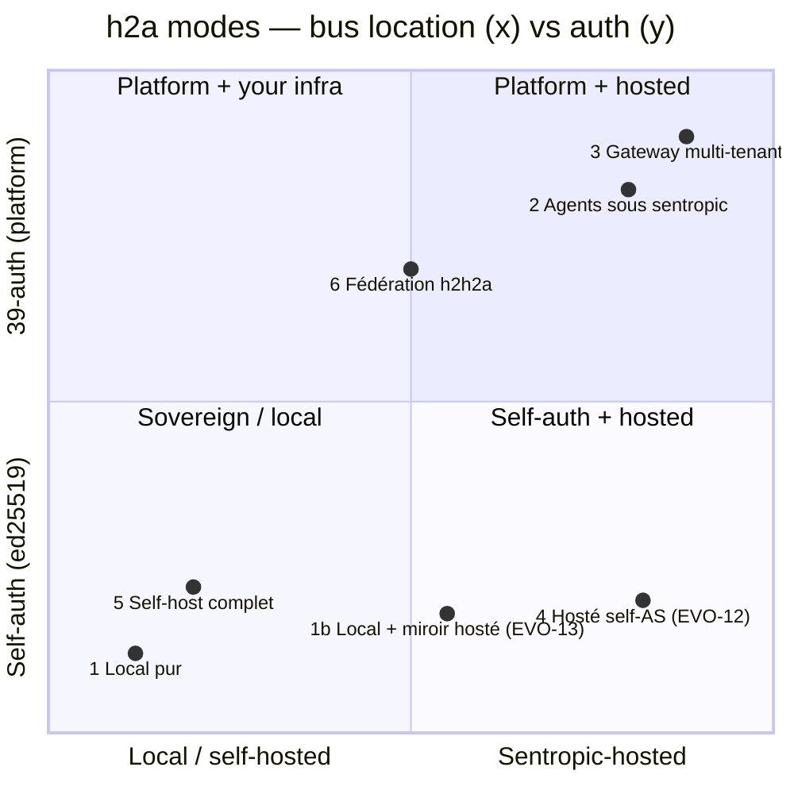
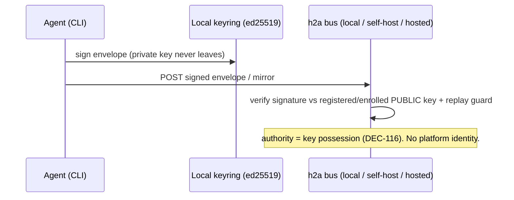
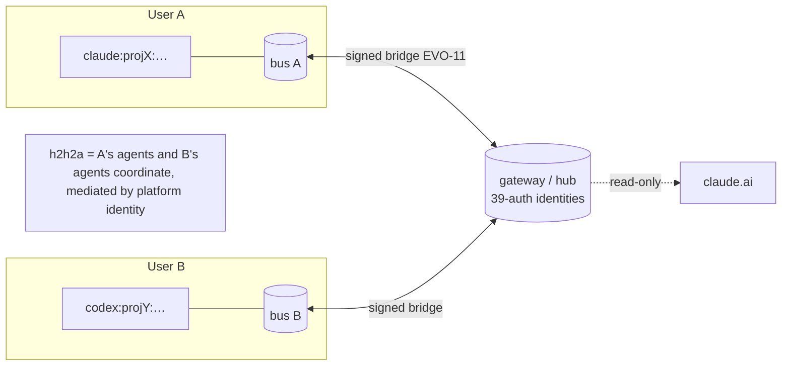

# h2a — operating modes & auth (framing)

Status: **framing / reference.** Clarifies the client postures for h2a and how
auth maps onto them. No code here; it's the map the roadmap hangs off.

## Three orthogonal axes

A "mode" is a point in this space, not a fixed menu:

- **Auth** — *self-auth* (the ed25519 keypair; possession = authority, DEC-116;
  **always present**, it's the substrate) **vs** *39-auth* (the sentropic OIDC
  IdP layered **on top** for platform/user identity & multi-tenancy).
- **Bus location** (the h2a root) — *local* / *self-hosted* (your own server) /
  *sentropic-hosted* (the Kapsule).
- **Capability** — *read* (observe state) **vs** *drive* (wake/pilot agents).
  ⚠️ The hosted surface today is **read-only**; drive (EVO-1 wake) is local-only.



## The modes

| # | Mode | Auth | Bus | Agents | Usage | Statut |
|---|---|---|---|---|---|---|
| **1** | Local pur | self (ed25519) | local | locaux | coordination locale | ✅ **live** |
| **1b** | Local + **miroir hosté read-only** (EVO-13) | self (clés enrôlées) | local **+** surface read-only hostée | locaux | coord. locale **+ observabilité externe** | ✅ **live** (P1+P2) |
| **4** | Hosté **self-AS** (EVO-12) | self (consent secret) | hosté, **mono-tenant** | — | **read-only** (observabilité) | 🟡 démo (enrôlement OFF) |
| **5** | Self-host complet | self (ed25519) | self-hosté | à toi | coord. souveraine, fédérable | ✅ capacité (`h2a remote serve` + bridge EVO-11) |
| **2** | Agents **sous contrôle sentropic** | **39-auth** | hosté sentropic | dans le cluster (sentropic-remote) | orchestration plateforme | 🟡 partiel (BR-39h conceptuel) |
| **3** | **Gateway multi-tenant** (client indépendant) | **39-auth** | hosté **multi-tenant** | les tiens, **n'importe où** | coordination + **h2h2a** | 🔵 cible cadrée (BR-39l), à bâtir |
| **6** | **Fédération multi-bus / h2h2a** | self **ou** 39-auth | plusieurs bus pontés | multi-humains/orgs | coordination inter-org | 🔵 primitive = bridge EVO-11 ; managé via 3 |

## Auth — two flows

**Self-auth (modes 1, 1b, 4, 5)** — the ed25519 keypair is the only authority
anchor; no platform login. The hosted self-AS (EVO-12) only adds a consent gate +
operator-enrolled keys for the mirror.



**39-auth broker (modes 2, 3)** — a thin self-AS *shim/gateway* keeps the DCR
that claude.ai requires, but **delegates the user login to 39-auth** (OIDC
`authorization_code`, live at `…/api/v1/auth/oauth/authorize`) and scopes the
h2a root per `sub`.

```mermaid
sequenceDiagram
    participant C as claude.ai connector
    participant G as h2a gateway/shim (self-AS + RP)
    participant I as 39-auth (sentropic OIDC IdP)
    participant H as h2a root (per-user, multi-tenant)
    C->>G: DCR (/register) + /authorize  (claude.ai needs DCR; 39-auth has none → shim provides it)
    G->>I: redirect: OIDC authorization_code + PKCE
    I-->>G: code → token → sub (the authenticated user)
    G->>G: map sub → that user's h2a root
    G-->>C: issue MCP access token bound to the user
    C->>G: /mcp tool calls
    G->>H: read/serve THAT user's root only
    Note over G,I: 39-auth = identity/credential/scope ; h2a = trust semantics (VALEUR/ATTENTION/CONFIANCE/MANDATE)
```

## h2h2a — federation (mode 6)

Cross-human / cross-org coordination = multiple buses bridged. Peer-to-peer
(self-host ↔ self-host, via EVO-11 `remote serve`) **or** hub-mediated (everyone
mirrors into the multi-tenant gateway of mode 3, which knows each user's identity).



## Strategic read

- **Live socle (self-auth)**: modes **1**, **1b** (✅), **5** (capacity), **4** (hosted read-only demo).
- **Platform overlay (39-auth)**: **2** scaffolded (sentropic-remote); **3** is the
  **north star** (multi-tenant gateway) and it unlocks **3 + 6 (h2h2a)**.
- **Missing on the hosted side everywhere**: *drive* (wake/pilot) — today only
  local (EVO-1). The hosted surface is read-only.
- The single big arbitrage that opens 3 and 6 is the **gateway decision**
  (gateway-vs-per-connector); 39-auth itself is ready to federate now
  (`/api/v1/auth/oauth/authorize` is live). See
  [[2026-06-03-h2a-mcp-tenancy-and-sentropic-gateway-framing]].
