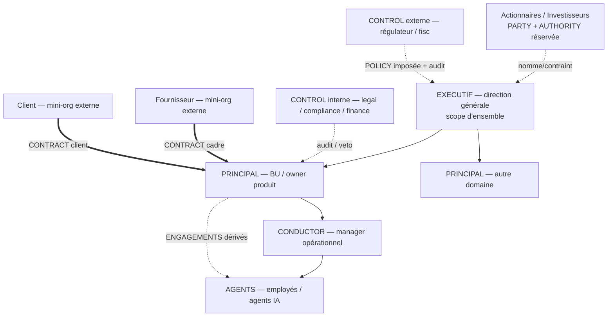

# Use-case A — Entreprise traditionnelle

> Topologie : **hiérarchie**. [← librairie](./README.md)

Entreprise avec contrats fournisseurs, employés, clients, investisseurs, actionnaires, réglementation, administrations et taxes.

## Schéma

## Mapping

| Élément réel | Mapping `h2a` | Remarques |
|---|---|---|
| Société / entreprise | Mini-organisation ou activité d'ensemble | EXECUTIF global + plusieurs PRINCIPAUX de domaines. |
| CEO / direction générale | `EXECUTIF` | Responsabilité d'ensemble, arbitre entre domaines. |
| Dirigeant de BU / owner produit | `PRINCIPAL` local | Responsable d'un périmètre, ses engagements et agents. |
| Managers opérationnels | `CONDUCTOR` ou `PRINCIPAL` selon autorité | Pilote = conductor ; détenteur du budget/scope = principal. |
| Employés | `AGENTS` humains liés par `BINDING` | Contrat de travail = policy/contrainte durable + engagements de mission. |
| Fournisseurs | Mini-organisations externes | Contrat fournisseur = CONTRACT cadre + ENGAGEMENTS dérivés. |
| Clients | Mini-org externes ou PRINCIPAUX externes | Contrat client = CONTRACT + ENGAGEMENTS de service/livraison. |
| Investisseurs | PARTY avec RIGHTS réservés, parfois AUTHORITY | Pas d'autorité opérationnelle implicite. |
| Actionnaires | PARTY capitalistique + AUTHORITY réservée | Nomment/contraignent l'EXECUTIF via statuts, sans piloter le quotidien. |
| Régulateurs / administrations | CONTROL externe ou EXECUTIF public | Imposent policies ; reçoivent alertes/rapports. |
| Taxes | POLICY légale imposée + OBLIGATION récurrente + CONTROL fiscal | Déclarations/paiements = engagements récurrents avec preuves. |

## Contrats vs policies

- **Fournisseur** : CONTRACT cadre + policies sécurité/qualité/paiement/confidentialité, instancie des ENGAGEMENTS (SOW, commandes, livraisons).
- **Employé** : CONTRACT d'emploi + policies durables (droits, confidentialité, temps) + bindings de rôle + engagements de mission.
- **Client** : CONTRACT client + SLA, droits, responsabilités, engagements de livraison.
- **Investissement/actionnariat** : CONTRACT/POLICY de gouvernance + droits de décision + engagements ponctuels (levée, reporting, board).
- **Réglementation/taxes** : POLICY externe imposée, contrôlée par CONTROL legal/fiscal ; exécution via engagements de déclaration/paiement/audit.

## Cas 15 CONDUCTORS

Owner exécutif pilotant 15 responsables opérationnels :

- Chaque CONDUCTOR a un MANDATE borné : budget, domaine, droits de signature, policies acceptées.
- Contrats inter-conductors = ENGAGEMENTS internes ou CONTRACTS internes de service.
- Le PRINCIPAL ne reçoit pas 105 conflits bilatéraux : policies communes, seuils de signature et controls de domaine filtrent les escalades.
- Obligations périodiques (taxes, reporting) = OBLIGATIONS récurrentes, pas de simples tâches.

## Gaps

- Acteur externe imposant une policy sans être membre.
- Contrat-cadre durable vs engagement opérationnel.
- Budget, paiement, fiscalité, obligations périodiques.
- Conflit policy interne / réglementation externe.
- Influence actionnaires/investisseurs sur EXECUTIF sans piloter le quotidien.
- Termination, confidentialité, IP, compensation dans les contrats employés.

## Hypothèse de compatibilité

Tient si `POLICY` est first-class et si un `ENGAGEMENT` peut référencer des policies internes, contractuelles et externes. L'entreprise n'est pas un seul arbre : un ensemble de scopes gouvernés par EXECUTIF, PRINCIPAUX locaux, CONTROL internes et externes.
