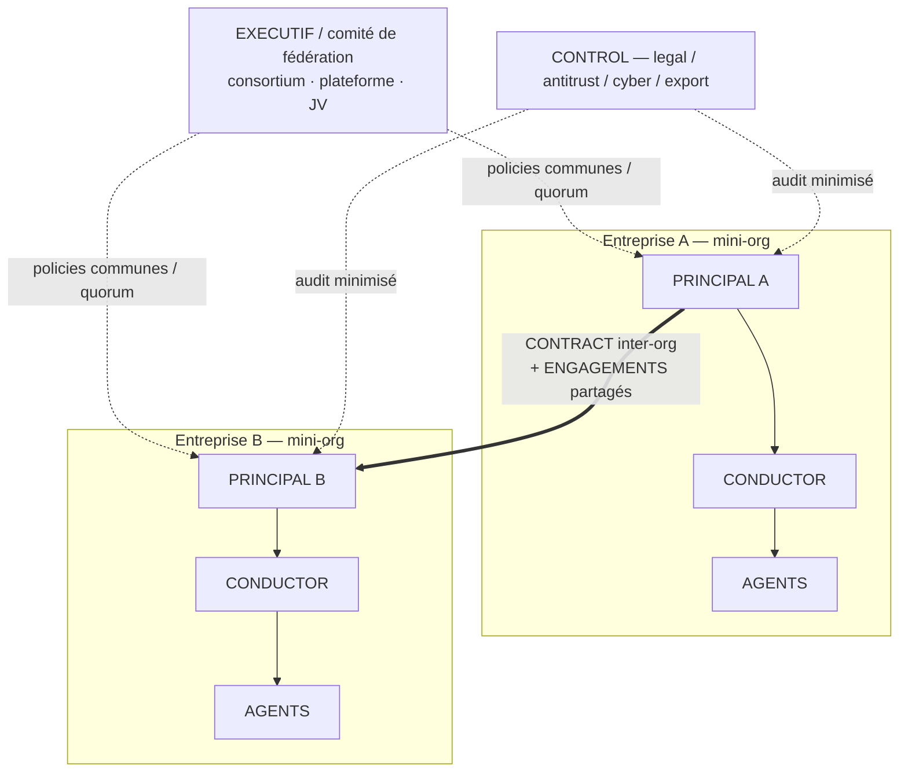

# Use-case B — Écosystème multi-entreprises

> Topologie : **fédération pair-à-pair**. [← librairie](./README.md)

Écosystème client-fournisseur, partenaires, compétiteurs, coopétition, plateformes, consortiums, chaînes de valeur.

## Schéma

## Modèles d'écosystème

| Modèle | Mapping `h2a` | Point critique |
|---|---|---|
| Client ↔ fournisseur | CONTRACT inter-org + ENGAGEMENTS dérivés | SLA, qualité, facturation, confidentialité, escalades. |
| Partenariat bilatéral | CONTRACT + policies communes + engagements | Gouvernance conjointe, responsabilités distribuées. |
| Consortium | Fédération avec EXECUTIF / comité | Plusieurs PRINCIPAUX, policies communes, votes/quorum. |
| Marketplace / plateforme | EXECUTIF de plateforme + policies d'accès | Participants gardent leur mini-org ; plateforme impose les règles. |
| Coopétition | CONTRACT limité + engagements cloisonnés | Cloisonnement info + CONTROL legal/antitrust forts. |
| Supply chain multi-niveaux | Chaîne d'engagements liés | Propagation de policy + audit de dépendances. |
| Joint venture | Nouvelle mini-org partagée | EXECUTIF propre, PRINCIPAUX participants, policies fondatrices. |
| Sous-traitance en cascade | Engagement principal + dérivés | Responsabilité finale ? Traçage des sous-engagements ? |

## Mapping initial

- Chaque entreprise = **mini-organisation** (PRINCIPAL(s), CONDUCTOR(s), AGENTS, CONTROL, policies propres).
- L'écosystème reste **pair-à-pair** ou devient une **fédération** (EXECUTIF, comité, governance policy).
- Contrats inter-entreprises = **CONTRACTS** pouvant contenir des **POLICY** et instancier des **ENGAGEMENTS partagés**.
- Contrôles critiques : legal, compliance, cyber, finance, qualité, confidentialité, antitrust, export control.

## Cas 15 CONDUCTORS

15 organisations/équipes autonomes négociant sans médiateur :

- Topologie : jusqu'à 105 liens pair-à-pair ; le protocole limite la divergence par registry, negotiation ledger, hashes, evidence packages.
- Les CONTRACTS inter-conductors déclarent disclosure, confidentialité, audit rights, antitrust/export-control si applicable.
- Sans EXECUTIF commun, un conflit de précédence bloque la signature ou produit une escalade explicite vers les PRINCIPAUX concernés.
- Un MCP central est un **bus**, pas une autorité. Une plateforme à pouvoir normatif devient un scope fédéré avec EXECUTIF/policies propres.

## Gaps

- Héritage de policy entre fédération, entreprise et engagement.
- Cloisonnement d'information entre partenaires/compétiteurs.
- Autorité d'un EXECUTIF de plateforme sur des PRINCIPAUX indépendants.
- Droit d'audit cross-org sans accès complet.
- Conflit entre policies incompatibles de deux organisations.
- State machine de négociation : offre, contre-offre, retrait, expiration, ratification, stabilisation.
- Propagation transitive de policies en supply chain sans divulguer tout le graphe.
- Garde-fous antitrust en coopétition : l'échange autorisé doit être contractualisé.

## Hypothèse de compatibilité

Tient si les scopes sont explicites et si `POLICY` supporte héritage, précédence et exception. Les écosystèmes ne doivent pas être forcés dans une hiérarchie unique : pair-à-pair, fédération, plateforme et consortium sont des topologies distinctes.
