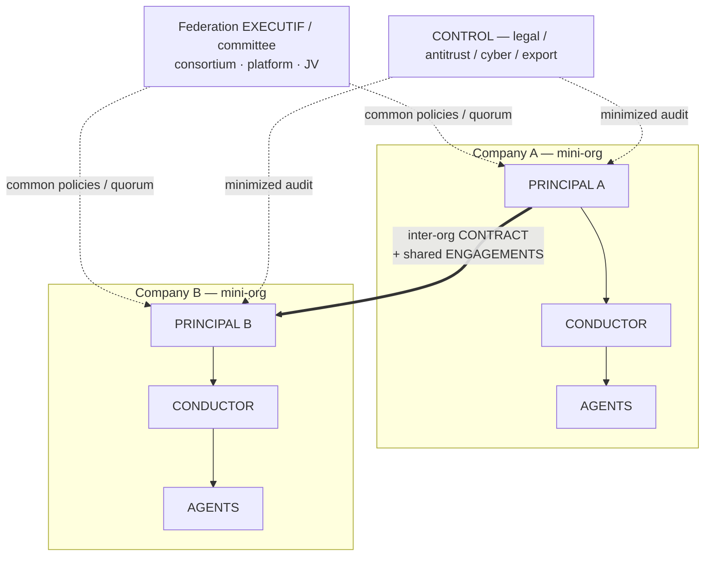

# Use-case B — Multi-organization ecosystem

> Topology: **peer federation**. [← library](./README.md)

A client-supplier ecosystem, partners, competitors, coopetition, platforms, consortia, value chains.

## Diagram

## Ecosystem models

| Model | `h2a` mapping | Critical point |
|---|---|---|
| Client ↔ supplier | inter-org CONTRACT + derived ENGAGEMENTS | SLA, quality, billing, confidentiality, escalations. |
| Bilateral partnership | CONTRACT + common policies + engagements | Joint governance, distributed responsibilities. |
| Consortium | Federation with EXECUTIF / committee | Several PRINCIPALs, common policies, votes/quorum. |
| Marketplace / platform | Platform EXECUTIF + access policies | Participants keep their mini-org; the platform imposes rules. |
| Coopetition | Limited CONTRACT + siloed engagements | Information siloing + strong legal/antitrust CONTROL. |
| Multi-tier supply chain | Chain of linked engagements | Policy propagation + dependency audit. |
| Joint venture | New shared mini-org | Own EXECUTIF, participant PRINCIPALs, founding policies. |
| Cascading subcontracting | Main engagement + derived ones | Who bears final responsibility? How to trace sub-engagements? |

## Initial mapping

- Each company = a **mini-organization** (its own PRINCIPAL(s), CONDUCTOR(s), AGENTS, CONTROL, policies).
- The ecosystem stays **peer-to-peer** or becomes a **federation** (EXECUTIF, committee, governance policy).
- Inter-company contracts = **CONTRACTS** that may contain **POLICY** and instantiate **shared ENGAGEMENTS**.
- Critical controls: legal, compliance, cyber, finance, quality, confidentiality, antitrust, export control.

## 15-CONDUCTORS case

15 autonomous organizations/teams negotiating without a mediator:

- Topology: up to 105 peer-to-peer links; the protocol limits divergence via registry, negotiation ledger, hashes, evidence packages.
- Inter-conductor CONTRACTS declare disclosure, confidentiality, audit rights, antitrust/export-control where applicable.
- Without a common EXECUTIF, a precedence conflict blocks the signature or produces an explicit escalation to the concerned PRINCIPALs.
- A central MCP is a **bus**, not an authority. A platform with normative power becomes a federated scope with its own EXECUTIF/policies.

## Gaps

- Policy inheritance across federation, company and engagement.
- Information siloing between partners/competitors.
- Authority of a platform EXECUTIF over independent PRINCIPALs.
- Cross-org audit rights without full access.
- Conflict between incompatible policies of two organizations.
- Negotiation state machine: offer, counter-offer, withdrawal, expiry, ratification, stabilization.
- Transitive policy propagation in a supply chain without disclosing the whole graph.
- Antitrust guardrails in coopetition: the allowed exchange must be contracted.

## Compatibility hypothesis

Holds if scopes are explicit and `POLICY` supports inheritance, precedence and exception. Ecosystems must not be forced into a single hierarchy: peer-to-peer, federation, platform and consortium are distinct topologies.
