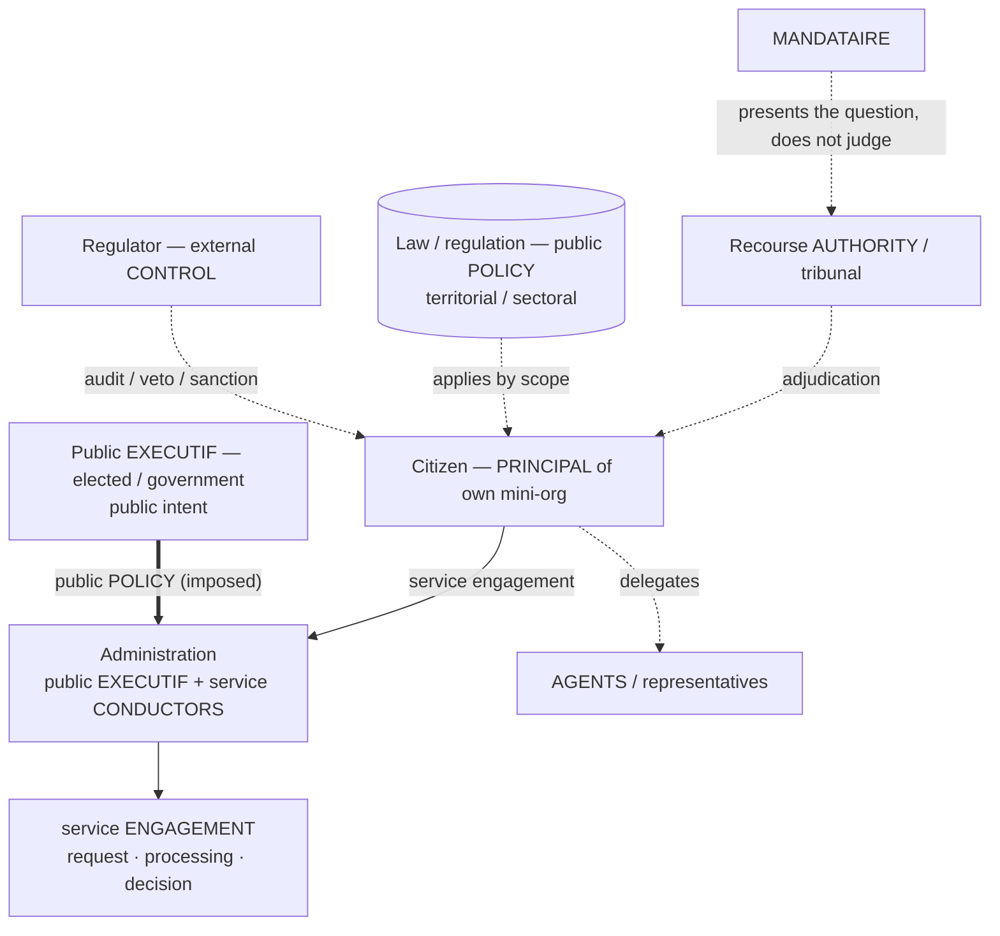

# Use-case C — Government / citizen

> Topology: **public authority**. [← library](./README.md)

Relations between citizens, administrations, public agencies, elected officials, regulators, public services, legal obligations, taxation, rights and recourse.

## Diagram

## Mapping

| Real-world element | `h2a` mapping | Notes |
|---|---|---|
| Citizen | PRINCIPAL of own personal mini-org | May delegate to agents, representatives, services. |
| Household / family / association | Citizen mini-organization | Several humans, internal roles and policies. |
| Administration | public EXECUTIF + service CONDUCTORS | Executes public policies and service engagements. |
| Elected officials / government | public EXECUTIF or mandate PRINCIPALs | Public intent, global arbitrations. |
| Regulator | external CONTROL | Audit, veto, alert, sanction. |
| Law / regulation | external public POLICY | Applies by territorial/sectoral/personal scope. |
| Tax | tax POLICY + filing/payment engagements | Citizen/company executes, administration controls. |
| Public service | service ENGAGEMENT / administrative workflow | Request, processing, decision, recourse, trace. |
| Recourse / tribunal | external AUTHORITY / adjudication | The MANDATAIRE presents, does not judge. |

## Patterns

- **Citizen ↔ administration**: service engagement under public policies.
- **Company ↔ administration**: filing, tax, compliance, license, inspection.
- **Regulator ↔ company/citizen**: external control with audit, sanction, injunction.
- **Government ↔ administration**: public EXECUTIF defines policies, administration runs engagements.
- **Citizen ↔ citizen**: personal mini-orgs linked by contract, mediation or recourse.

## 15-CONDUCTORS case

15 services/desks under a citizen, company or administration PRINCIPAL (the public-authority variant of [use-case D](./d-principal-15-conductors.md)):

- Public policies are often `imposed`, not signed locally.
- Conductors negotiate service/compliance engagements, but some obligations come from an external authority.
- Escalations target PRINCIPAL, public EXECUTIF, regulator, recourse or tribunal by scope.
- Evidence is minimized: the administration requests a proof, not the whole internal journal.

## Gaps

- Mandatory public policy without individual contractual consent.
- Distinguishing law, regulation, administrative procedure and service engagement.
- Recourse, appeal, adversarial evidence, MANDATAIRE neutrality.
- Temporality: political mandate, law validity, statute of limitations, periodic obligations.
- Power asymmetry between administration and citizen.
- Jurisdiction, recourse, appeal and temporal validity without local contractual consent.

## Compatibility hypothesis

Holds if `POLICY` can be external, mandatory and territorialized, and if the protocol distinguishes voluntary contractual engagement, regulatory obligation and recourse. The citizen stays PRINCIPAL of their perimeter, but the administration can impose policies and compliance engagements via an explicit public authority.

**Nearest built-in profile**: **`C_GOVERNMENT_CITIZEN`** (machine-readable as `H2A_ABC_MODEL_PROFILES`, verified by `auditAbcModelCompatibility('C_GOVERNMENT_CITIZEN')` — DEC-041). **Deltas vs the enterprise tree**: external mandatory `POLICY` applied by territorial/sectoral/personal scope (no local contractual consent); a `Recourse AUTHORITY`/tribunal adjudicating disputed service `ENGAGEMENT`s; and the citizen remaining `PRINCIPAL` of their own perimeter under that imposed authority (the power-asymmetry case).
