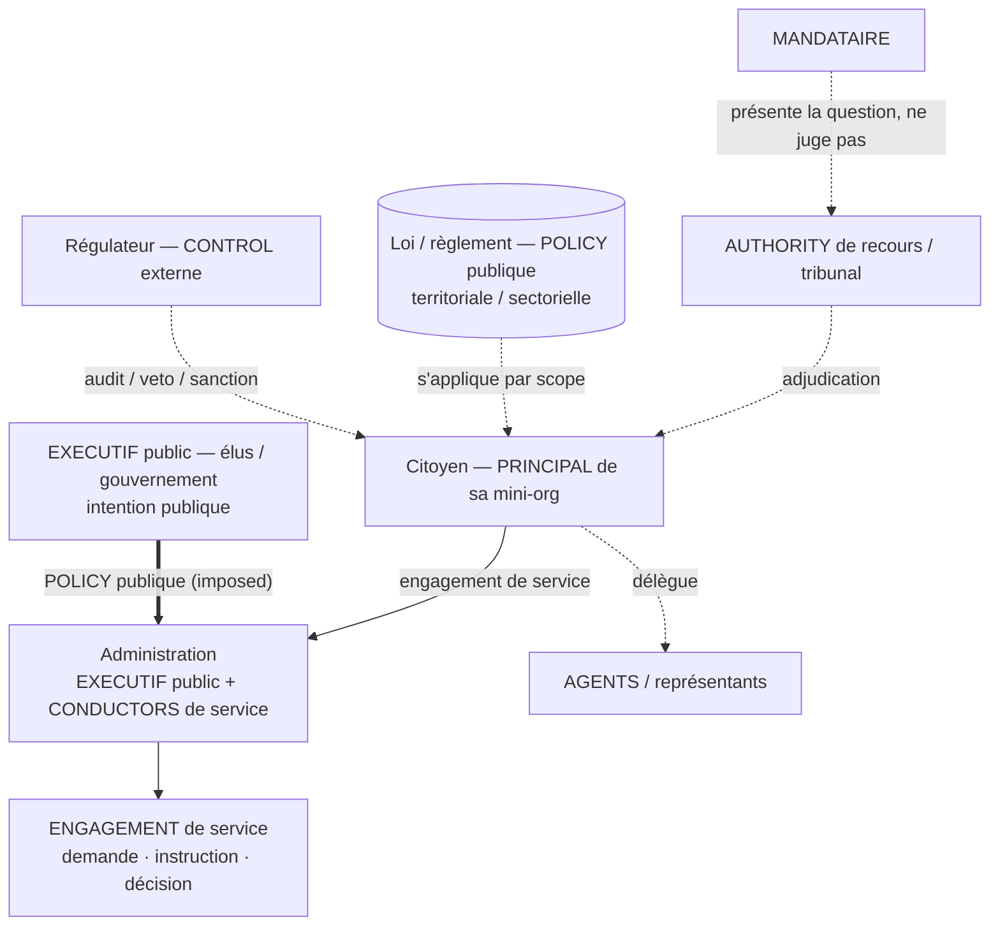

# Use-case C — Gouvernement / citoyen

> Topologie : **autorité publique**. [← librairie](./README.md)

Relations entre citoyens, administrations, agences publiques, élus, régulateurs, services publics, obligations légales, fiscalité, droits et recours.

## Schéma

## Mapping

| Élément réel | Mapping `h2a` | Remarques |
|---|---|---|
| Citoyen | PRINCIPAL de sa mini-org personnelle | Peut déléguer à agents, représentants, services. |
| Foyer / famille / association | Mini-organisation citoyenne | Plusieurs humains, rôles et policies internes. |
| Administration | EXECUTIF public + CONDUCTORS de service | Exécute policies publiques et engagements de service. |
| Élus / gouvernement | EXECUTIF public ou PRINCIPAUX de mandat | Intention publique, arbitrages globaux. |
| Régulateur | CONTROL externe | Audit, veto, alerte, sanction. |
| Loi / règlement | POLICY publique externe | S'applique par scope territorial/sectoriel/personnel. |
| Impôt / taxe | POLICY fiscale + engagements déclaration/paiement | Citoyen/entreprise exécute, administration contrôle. |
| Service public | ENGAGEMENT de service / workflow administratif | Demande, instruction, décision, recours, trace. |
| Recours / tribunal | AUTHORITY externe / adjudication | Le MANDATAIRE présente, ne juge pas. |

## Patterns

- **Citoyen ↔ administration** : engagement de service sous policies publiques.
- **Entreprise ↔ administration** : déclaration, taxe, conformité, licence, inspection.
- **Régulateur ↔ entreprise/citoyen** : control externe avec audit, sanction, injonction.
- **Élu/gouvernement ↔ administration** : EXECUTIF public définit policies, administration conduit engagements.
- **Citoyen ↔ citoyen** : mini-orgs personnelles liées par contrat, médiation ou recours.

## Cas 15 CONDUCTORS

15 services/guichets sous un PRINCIPAL citoyen, entreprise ou administration :

- Les policies publiques sont souvent `imposed`, pas signées localement.
- Les conductors négocient des engagements de service/conformité, mais certaines obligations viennent d'une autorité externe.
- Les escalades visent PRINCIPAL, EXECUTIF public, régulateur, recours ou tribunal selon le scope.
- Preuves minimisées : l'administration demande une preuve, pas tout le journal interne.

## Gaps

- Policy publique obligatoire sans consentement contractuel individuel.
- Distinguer droit, règlement, procédure administrative et engagement de service.
- Recours, appel, preuve contradictoire, neutralité du MANDATAIRE.
- Temporalité : mandat politique, validité des lois, prescription, obligations périodiques.
- Asymétrie de pouvoir administration/citoyen.
- Juridiction, recours, appel et validité temporelle sans consentement contractuel local.

## Hypothèse de compatibilité

Tient si `POLICY` peut être externe, obligatoire et territorialisée, et si le protocole distingue engagement contractuel volontaire, obligation réglementaire et recours. Le citoyen reste PRINCIPAL de son périmètre, mais l'administration peut imposer des policies et engagements de conformité via une autorité publique explicite.
