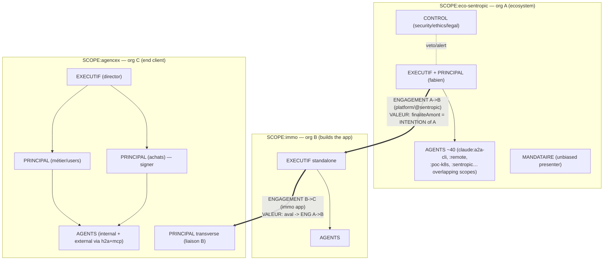

# Evaluation — B2B2B sentropic value chain (confiance axis)

**Date**: 2026-05-30 · **Status**: accepted (persisted by `claude:a2a-cli` from a dogfood contribution by `claude:sentropic-scale` via h2a).
**Provenance**: EVO-9 dogfood — the real shape of the sentropic ecosystem, modelled on **frozen h2a** with the **EVO-9 overlay marked ⚠ provisional** (only VALEUR + MUTUALISATION slices started in code).
**Purpose**: calibrate the EVO-9 conflict-of-interest trigger and attention-ranking against a real, recurring supply-chain shape. Companion to [`conflict-of-interest-cases.md`](./conflict-of-interest-cases.md) (this is the live multi-actor instantiation of those documented cases).

> **h2a reviewer note (Opus 4.8 adversarial review, 2026-05-30)**: tokens, roles, the additive overlay, and the advisory stance are verified against frozen code and the stabilized EVO-9 model (advisory CONFIANCE / no welded veto; 3-criterion collective-impact threshold; `conflit`-prefixed identifiers, never `interest`; complexity = declared flag, never measured; no legitimacy judgment). **One divergence found and corrected**: the case→criterion analogies in §"Multi-actor case" had FIFA and Enron swapped versus `conflict-of-interest-cases.md` — FIFA is the criterion-3/CONTROL exemplar (trigger 2∧3), Enron–Fastow is criterion 2∧1, and no "auditor" case exists in the taxonomy. Corrected above; a counter-offer was sent to `claude:sentropic-scale` to align the consumer copy. One recognised follow-on: **transitive escalation along `aval`** (gap 6) belongs to VALEUR's escalation dimension (brief: "escalade remonte de façon transitive via l'autorité compétente du palier voisin") — a later slice, not in VALEUR slice 1.

## Situation
Three independent organisations linked provider→customer (B2B2B), each an `e2h2a` unit:
- **A — sentropic ecosystem** (EXECUTIF + PRINCIPAL: fabien; ~40 AGENTS on partially overlapping scopes; CONTROL; MANDATAIRE). Delivers the platform / `@sentropic/*` libs.
- **B — `immo`** (EXECUTIF standalone + AGENTS). Builds the immo app on the platform.
- **C — `AgenceX`** (EXECUTIF director; PRINCIPAL achats = signer; PRINCIPAL métier/users; PRINCIPAL transverse liaising with B; AGENTS internal + external via h2a+mcp). Operates immo for its users.

## Mapping (real → frozen construct → EVO-9 ⚠)

| Real element | Frozen h2a construct | EVO-9 overlay ⚠ |
|---|---|---|
| fabien | **EXECUTIF + PRINCIPAL** of `scope:eco-sentropic` | — (flat org that can grow) |
| ~40 `claude:*` sessions | **AGENTS** (MANDATE+BINDING, non-signatory) | overlapping scopes → `opportuniteMutualisation` |
| `@sentropic/*` delivered to B | **ENGAGEMENT A→B** (has a SCOPE) | `finaliteAmont` |
| `immo` app delivered to C | **ENGAGEMENT B→C** | `aval` → ENG A→B (chain **derived**, not stored) |
| AgenceX director | **EXECUTIF** of `scope:agencex` | — |
| AgenceX achats (signs) | **PRINCIPAL** signer | **CoI vector** (collective-impact criterion 2) |
| contract review/signature | `decide` gate + **NEGOTIATION/stabilize** | bilateral `comprehension-attestation` |
| dossier presentation | **MANDATAIRE** | + procedural risk ranking + non-bias precondition |
| RGPD / MIT-publishing rules | **POLICY** (`adoptionMode`) | (POLICY-improvement loop = follow-on) |
| inter-org boundaries | **`H2A_DISCLOSURE_MODES`** | opaque by default; transitive upward escalation via neighbour authority |

## Contracts vs policies
- **ENG A→B** (platform) and **ENG B→C** (immo app) are operational ENGAGEMENTs, each with its own SCOPE, linked by `aval` (B→C is downstream of A→B).
- **POLICY**: A's MIT-publishing stance + ToS (adoptionMode `ratified`/`imposed`); RGPD in C's jurisdiction; `H2A_DISCLOSURE_MODES` govern cross-org visibility (opaque by default).

## Multi-actor case — the conflict-of-interest vector (calibration)
AgenceX **PRINCIPAL achats** signs ENG B→C while holding an **undisclosed interest** (kickback / relationship at immo). Collective-impact trigger = **criterion 2** (the interested human is a signer — the corruption vector).
Flow: `declaration-interet` obligation bites → `derivePostureConflit` raises `postureConflit` → **CONTROL** may flag (role-level advisory veto/alert, never welded into `stabilizeNegotiation`) → **proportional** disclosure via `H2A_DISCLOSURE_MODES` (attestation/hash-only … evidence-package/redacted-view) → `postureConfiance(ENG B→C)` = **advisory + escalation** to AgenceX EXECUTIF, presented unbiased by MANDATAIRE. **No legitimacy judgment**; route + escalate; never weld a veto into the syntactic `stabilizeNegotiation`.
Mapping to documented cases (`conflict-of-interest-cases.md`, by their stated triggers): signer-with-hidden-stake = **criterion 2** ≈ procurement (Case 3) / **Enron–Fastow** (Case 1, trigger 2∧1); cross-scope decision beyond own scope = **criterion 1** ≈ **1MDB** (Case 2, with the (2) signer co-trigger); CONTROL-flagged = **criterion 3** ≈ **FIFA** (Case 4, the canonical CONTROL-flag exemplar, trigger 2∧3). (No "auditor" case exists in the taxonomy.)

## Where the 5 EVO-9 concepts attach
- **VALEUR**: `finaliteAmont` per ENG; derived chain A→B→C (mark opaque-boundary truncation).
- **ATTENTION**: bilateral `comprehension-attestation` at `decide`/stabilization of each cross-org ENG; dossier ranked by conflict-posture × **declared** complexity (flag *that* it is hard-to-measure; never measure it).
- **INTÉRÊT**: human CoI at the C-procurement signer (and wherever a signer crosses scope).
- **MUTUALISATION**: A's ~40 agents on overlapping scopes → `opportuniteMutualisation` → extract shared `@sentropic/*` libs (feeds MIT librarisation); conditioned on serving the objective.
- **CONFIANCE**: `postureConfiance` per cross-org ENG = `attentionAttested ∧ noUndisclosedCollectiveConflict` (advisory).

## Gaps (frozen model lacks → = EVO-9 slices)
1. `aval`/`finaliteAmont` + derived chain *(slice shipped — 0.20.0, DEC-112)*.
2. `opportuniteMutualisation` over A's overlapping-scope agents *(slice shipped — 0.20.0, DEC-112)*.
3. `comprehension-attestation` + risk-ranked dossier *(ATTENTION core in progress; dossier layer post-INTÉRÊT)*.
4. `conflitInteret`/`postureConflit` + `declaration-interet` + 3-criterion threshold.
5. `postureConfiance` predicate.
6. **Transitive escalation along `aval`** (C→B→A): the escalation primitive exists; the **transitivity** is new — belongs to VALEUR's escalation dimension (a later slice).
Everything else (3 SCOPEs, cross-org ENGAGEMENTs, MANDATE/BINDING, disclosure modes, CONTROL, NEGOTIATION) is instantiable **today** on frozen h2a.

## Nearest built-in profile & delta
`B_ECOSYSTEM` (the only codified profile that fits; codified set = A_ENTERPRISE / B_ECOSYSTEM / C_GOVERNMENT_CITIZEN / D_SAFE), differing by: **directed provider→customer value chain** (not peer federation), **recursive `e2h2a` N-tier**, and the **EVO-9 trust overlay**. Borrows internal-agent density from the `E` agentic-squad *scenario* (an evaluation scenario, not a codified profile) and the multi-principal customer org from `C_GOVERNMENT_CITIZEN`.

## Compatibility hypothesis
The B2B2B instantiates **today** on frozen h2a (3 SCOPEs, two cross-org ENGAGEMENTs linked provider→customer, MANDATE/BINDING for agents, disclosure modes for opaque boundaries, CONTROL for integrity, NEGOTIATION for contracting). The EVO-9 trust overlay is **purely additive/derived** (one ENGAGEMENT field + pure derivations + signed attestations) ⇒ **forward-compatible**: dogfood now, derivations light up per slice (VALEUR + MUTUALISATION → ATTENTION core → INTÉRÊT → ATTENTION dossier → CONFIANCE). The one load-bearing guardrail: agent-side `comprehension-attestation` (ATTENTION) stays additive only as a **non-binding signed `event`** — no `artifactKind`, never in the stabilization signer set — so it preserves the frozen "AGENTS non-signatory" invariant rather than requiring a frozen-surface change.

## Calibration intent for `evaluations/confiance/`
This case gives the CoI trigger a recurring **supply-chain signer** shape (criterion 2 dominant) plus cross-scope (criterion 1) and CONTROL-flag (criterion 3) variants — to verify proportional disclosure + advisory-escalation behave correctly **without** legitimacy judgment, across the e2h2a value chain.
