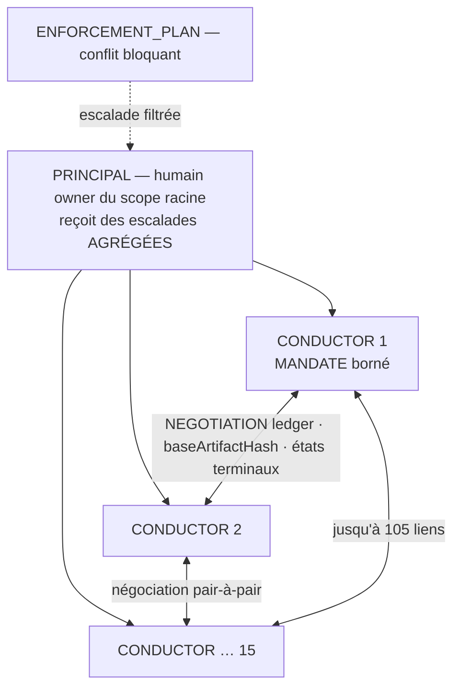

# Use-case D — 1 PRINCIPAL / 15 CONDUCTORS (sans médiateur)

> Topologie : **étoile sans médiateur inter-contrat**. [← librairie](./README.md)

Un humain est PRINCIPAL de 15 CONDUCTORS. Chaque conductor peut négocier avec les autres pour stabiliser des CONTRACTS, POLICIES, ENGAGEMENTS ou amendements. Il n'existe pas encore de médiateur inter-contrat.

## Schéma

## Mapping

| Élément réel | Mapping `h2a` | Risque |
|---|---|---|
| Humain owner | PRINCIPAL du scope racine | Goulot d'escalade si tout remonte. |
| 15 conductors | INSTANCE rôle CONDUCTOR + MANDATE borné | Mandats trop larges = signatures incohérentes. |
| Découverte | REGISTRY local/MCP | Inscription ≠ droit d'agir. |
| Négociation | NEGOTIATION ledger par sujet | Divergence sans base hash / état terminal. |
| Accord stabilisé | CONTRACT/POLICY/ENGAGEMENT signé | Stable seulement si hash identique + signatures requises. |
| Conflit inter-contrat | ENFORCEMENT_PLAN + escalade | Pas de résolution automatique en V1. |
| Audit | Journaux append-only + evidence packages | Trop de logs bruts = fuite d'information. |

## Règles V1 proposées

- Chaque CONDUCTOR déclare `mandate.rights` : `negotiate`, `propose`, `accept`, `sign`, `escalate`, `audit`, avec scopes autorisés.
- Une proposition référence toujours `baseArtifactHash` ; si la base change, la proposition devient stale.
- Une négociation se termine uniquement par `stabilized`, `rejected`, `withdrawn`, `expired` ou `abandoned`.
- Une signature inclut `{instance, role, scope, mandate, artifactHash}`.
- Un conflit policy/contract bloque la signature si la policy déclare `blocking: true` ; sinon il est tracé et escaladé.
- Le PRINCIPAL reçoit des escalades **agrégées** : par conflit, par domaine CONTROL, ou par batch — pas un flux brut de toutes les contre-propositions.

## Compatibilité ABC

- **A entreprise** : 15 responsables internes — mandats, budget, policies communes, obligations récurrentes, controls de domaine.
- **B écosystème** : 15 organisations/partenaires — disclosure contrôlée, antitrust/confidentialité, registry non autoritaire, deadlock explicite.
- **C gouvernement/citoyen** : 15 services/guichets — policies imposées, juridiction, recours, preuves minimisées.

Depuis DEC-041, ce mapping est exposé en machine-readable par `H2A_ABC_MODEL_PROFILES` et vérifié par `auditAbcModelCompatibility(modelId)`. Les profils intégrés sont stables contre le vocabulaire V1 (`ok:true`) mais conservent des gaps explicites (`ready:false`).

## Gaps

- Priorité entre policies en cas de conflit bloquant.
- Format exact de MANDATE et signature.
- Règle de batching des escalades pour éviter la saturation du PRINCIPAL.
- Limites de disclosure standard par type de CONTROL.
- Passage éventuel à un médiateur inter-contrat V2.
