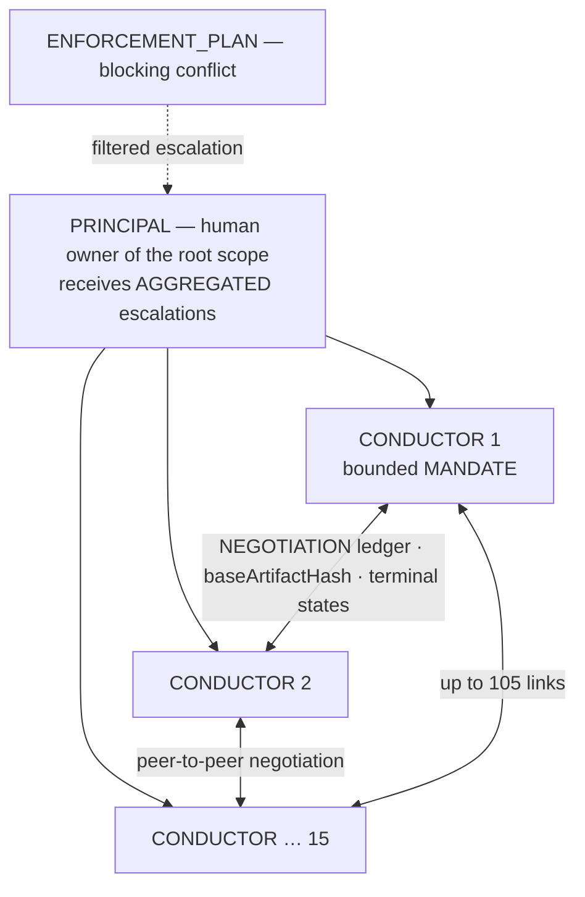

# Use-case D — 1 PRINCIPAL / 15 CONDUCTORS (no mediator)

> Topology: **star, no inter-contract mediator**. [← library](./README.md)

A human is PRINCIPAL of 15 CONDUCTORS. Each conductor can negotiate with the others to stabilize CONTRACTS, POLICIES, ENGAGEMENTS or amendments. There is no inter-contract mediator yet.

## Diagram

## Mapping

| Real-world element | `h2a` mapping | Risk |
|---|---|---|
| Human owner | PRINCIPAL of the root scope | Escalation bottleneck if everything bubbles up. |
| 15 conductors | INSTANCE in CONDUCTOR role + bounded MANDATE | Over-broad mandates = inconsistent signatures. |
| Discovery | local/MCP REGISTRY | Registration ≠ right to act. |
| Negotiation | NEGOTIATION ledger per subject | Divergence without base hash / terminal state. |
| Stabilized agreement | signed CONTRACT/POLICY/ENGAGEMENT | Stable only if identical hash + required signatures. |
| Inter-contract conflict | ENFORCEMENT_PLAN + escalation | No automatic resolution in V1. |
| Audit | append-only journals + evidence packages | Too many raw logs = information leak. |

## Proposed V1 rules

- Each CONDUCTOR declares `mandate.rights`: `negotiate`, `propose`, `accept`, `sign`, `escalate`, `audit`, with authorized scopes.
- A proposal always references `baseArtifactHash`; if the base changes, the proposal becomes stale.
- A negotiation ends only in `stabilized`, `rejected`, `withdrawn`, `expired` or `abandoned`.
- A signature includes `{instance, role, scope, mandate, artifactHash}`.
- A policy/contract conflict blocks the signature if the policy declares `blocking: true`; otherwise it is traced and escalated.
- The PRINCIPAL receives **aggregated** escalations: per conflict, per CONTROL domain, or per batch — not a raw stream of every counter-proposal.

## ABC compatibility

- **A enterprise**: 15 internal leads — mandates, budget, common policies, recurring obligations, domain controls.
- **B ecosystem**: 15 organizations/partners — controlled disclosure, antitrust/confidentiality, non-authoritative registry, explicit deadlock.
- **C government/citizen**: 15 services/desks — imposed policies, jurisdiction, recourse, minimized evidence.

Since DEC-041, this mapping is machine-readable through `H2A_ABC_MODEL_PROFILES` and verified by `auditAbcModelCompatibility(modelId)`. Built-in profiles are stable against the V1 vocabulary (`ok:true`) but keep explicit gaps (`ready:false`).

## Gaps

- Priority between policies on a blocking conflict.
- Exact MANDATE and signature format.
- Escalation batching rule to avoid saturating the PRINCIPAL.
- Standard disclosure limits per CONTROL type.
- Possible move to an inter-contract mediator in V2.
