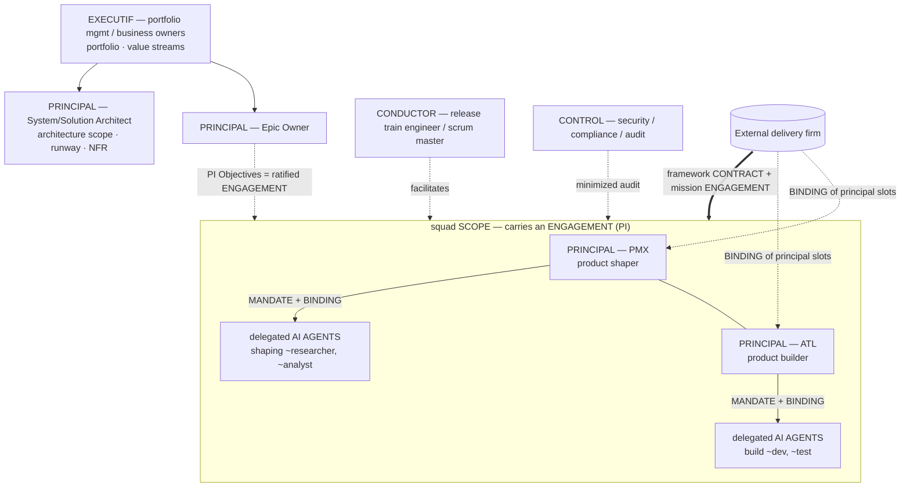

# Use-case E — Agentic-delivery squad with contracted roles

> Topology: **agile train + squads**. [← library](./README.md)

A scaled-agile organization (SAFe-style) that manages a mix of **human roles** and **AI agents**, where some roles are **contracted in** from an external delivery firm. The base squad is a **PMX** (*product shaper*) and an **ATL** (*product builder*), both *builders* of the squad, each augmented by their own delegated AI agents.

> **On PMX / ATL**: the acronyms appear to be proprietary/internal labels — no public founding document names them (see [References](#references)). Their *substance* maps onto two publicly described archetypes: **PMX ≈ the augmented Product Manager / product shaper** (defines the why, shapes the what, orchestrates discovery/spec agents) and **ATL ≈ the AI product builder / product maker** (materializes the shape into a tested artifact, orchestrates build agents). Both are hands-on *builders*, not managers.

## Diagram

## Mapping

| Construct (SAFe-style / contracted delivery) | `h2a` mapping | Notes |
|---|---|---|
| Lean Portfolio Mgmt / Business Owners | `EXECUTIF` | Umbrella scope, funds/arbitrates; does not pilot day-to-day. |
| Epic Owner | `PRINCIPAL` (epic/portfolio scope) | Owns an epic's outcome + budget. |
| Product Owner / Product Mgmt (client side) | `PRINCIPAL` (product scope) | When product ownership stays client-side above the squad. |
| **System / Solution / Enterprise Architect** | `PRINCIPAL` (architecture scope) | **Owns** the runway and NFRs (otherwise chaos); `CONTROL` is not the architecture. |
| RTE / Scrum Master / STE | `CONDUCTOR` | Facilitates; does not own the scope. |
| Security / Compliance / Audit | `CONTROL` | Audit, veto, minimized view. |
| **PMX — product shaper** | `PRINCIPAL` (*shaping* facet) | Co-owner of the squad; delegated AI agents. |
| **ATL — product builder** | `PRINCIPAL` (*build* facet) | Co-owner of the squad; delegated AI agents. |
| PMX/ATL's AI agents | mandated `AGENTS` (or `SUBAGENTS`, DEC-068) | Delegated via `MANDATE` + `BINDING` inside the principal's scope. |
| Squad / ART / Solution Train / Value Stream | `SCOPE` (squad → federation) | Durable scope; it *carries* an engagement, it *is not* the engagement. |
| PI / PI Objectives / commitment | `ENGAGEMENT` | Executable mission ratified at PI planning; *has* the train scope. |
| Role filled via external firm | `CONTRACT` framework + `ENGAGEMENT` + `BINDING` | The client contracts the firm; principal slots are bound to firm instances. |
| Guardrails / DoD / NFR / lean budget | `ENGAGEMENT` clauses (default) or standalone `POLICY` | Engagement-centric; standalone `POLICY` reserved for cross-cutting/imposed rules (portfolio). |

## PMX and ATL — the two squad principals (core of the model)

Both are **builders** (hands-on producers, not managers), each owning a distinct facet of the product and each orchestrating their own AI agents under the "delegate, review, own" loop. The split follows the industry's product/build convergence — the *augmented PM / shaper* who defines the why and shapes the what, and the *AI product builder* who materializes it.

| | **PMX — product shaper** | **ATL — product builder** |
|---|---|---|
| Owns | product intent & shape: discovery, value, problem framing, spec, validation hypotheses, user empathy | materialization: turning the shape into working, architecture-sound software (MVP → product) |
| Produces | validated direction, specs, throwaway prototypes-for-validation | running increments, tested code, integrations |
| Augmenting agents | shaping agents: research, analysis, spec drafting, prototyping | build agents: codegen, test, integration, refactor |
| `h2a` role | `PRINCIPAL` of `squad/shaping` | `PRINCIPAL` of `squad/build` |
| Seam | hands a validated, specified direction across the shape→build seam | pulls from it; feeds buildability constraints back |

### Scopes & signatures (resolved)

- One **squad `SCOPE`** with **two sub-scopes** — `squad/shaping` (PMX) and `squad/build` (ATL), one `PRINCIPAL` each — so ownership, mandate and audit boundaries are unambiguous (cleaner than two principals sharing a single scope).
- The squad's **PI `ENGAGEMENT`** spans both sub-scopes → it requires **both** signatures (PMX + ATL): joint stabilization, multi-human `shared` mode (DEC-042). Artifacts internal to a sub-scope are signed by that sub-scope's principal alone.

### Agent delegation (resolved)

- Each principal delegates AI agents into its sub-scope as `AGENTS` via an explicit `MANDATE` (`{instance, role, scope, rights}`) + a `BINDING` of the slot to the agent instance.
- Default agent rights are **execution-only / non-signing**: `propose`, `negotiate`, `audit` — **never `sign`**. Accountability stays on the human principal who reviews and signs ("delegate, review, own"). An agent's authority never exceeds its principal's mandate.
- If an agent spawns its own sub-agents → the **SUBAGENTS** layer (DEC-068: address `atl~test-runner`, authority consolidated under the parent, per-parent audit + revocation).

## Contracting the roles

- A framework `CONTRACT` links the client and the external delivery firm (SLA, confidentiality, IP, audit rights, exit).
- The squad's work is a derived `ENGAGEMENT` (charter, success criteria, duration, journal).
- The **principal slots** PMX/ATL are **bound** to instances provided by the firm → the firm carries **principal-level** responsibility (product + build), not staff augmentation. The client `EXECUTIF`/Epic Owner stays above.
- The same `CONTRACT → ENGAGEMENT → BINDING` scheme covers an AI agent supplied under contract (the instance bound to the slot is an agent instead of a human).

## N-squads case

Several squads (each PMX+ATL+agents) under one train:

- Each squad negotiates its PI `ENGAGEMENT`; the `EXECUTIF` (portfolio) arbitrates the portfolio, not each task.
- Inter-squad escalations target the **scope's competent authority** — the train/architecture `PRINCIPAL` or portfolio `EXECUTIF` — with the RTE/`CONDUCTOR` **facilitating/routing** (not deciding); not a raw stream to the top.
- Common guardrails (DoD, NFR, runway) are owned by the architecture `PRINCIPAL`, referenced as engagement clauses; a blocking conflict escalates (DEC-041, `policy-precedence` `partial`).

## Gaps

- **Resolved**: PMX/ATL co-ownership (two sub-scopes, joint PI-engagement signature) and delegated-agent rights (execution-only, non-signing) — see the section above.
- `AGENTS` mandated vs `SUBAGENTS` (DEC-068) boundary: at what fan-out level an agent becomes individually addressable/auditable.
- The contract grants **principal-level** authority to an external provider: which control/exit clauses bound it?
- Guardrails as engagement clauses vs standalone `POLICY`: switch criterion (cross-cutting/imposed ⇒ POLICY).

## Compatibility hypothesis

Holds with the V1 vocabulary: **no new role or artifact**. The scaled-agile + contracted-delivery model maps onto `EXECUTIF`/`PRINCIPAL`/`CONDUCTOR`/`AGENTS`(+`SUBAGENTS`)/`CONTROL`, the `CONTRACT`/`ENGAGEMENT`(/`POLICY`) stack, and the `MANDATE`+`BINDING` pair for agent delegation and role contracting. Watch points: architecture ownership **must** be a `PRINCIPAL` (not only `CONTROL`), and the train/squad is a `SCOPE` distinct from the `ENGAGEMENT` it carries. **Shipped**: the executable `D_SAFE` profile (machine-readable, `H2A_ABC_MODEL_PROFILES.D_SAFE`, topology `agile-train`) is derived from this use-case and verified by `auditAbcModelCompatibility("D_SAFE")` — DEC-080. This use-case **is** the source of `D_SAFE`, so the nearest-profile delta is ≈ **none** — it is the canonical agile-train reference; the only open watch points are the external-`PRINCIPAL` contracting clauses (control/exit) and the `AGENTS`↔`SUBAGENTS` fan-out boundary (DEC-068).

## References

No public founding document defines the **PMX**/**ATL** acronyms by name; they appear to be proprietary/internal role labels. The closest public sources for the underlying operating model (AI-augmented micro-squad; product/build convergence; human + agent teams) are listed for context only:

- Sébastien Bourguignon (Sopra Steria Next), *« De la micro-squad augmentée à un modèle opérationnel … à l'ère du SDLC agentique »*, Journal du Net, 2026-04-09 — [journaldunet.com](https://www.journaldunet.com/developpeur/1549427-de-la-micro-squad-augmentee-a-un-modele-operationnel-comment-structurer-les-equipes-produit-a-l-ere-du-sdlc-agentique/) — the augmented micro-squad operating model.
- SFEIR, *Product Manager augmenté : comment l'IA révolutionne le job de PM/PO* — [sfeir.dev](https://www.sfeir.dev/ia/product-manager-augmente-comment-lia-revolutionne-le-job-de-pm-po/) — the **shaper** archetype (PMX).
- Converteo, *AI Product Builder vs PM et Designer* — [converteo.com](https://converteo.com/blog/ai-product-builder-roles-equipe-ia/) — the **builder** archetype (ATL): "materializes the vision into a testable artifact".
- CIO, *How agentic AI will reshape engineering workflows in 2026* — [cio.com](https://www.cio.com/article/4134741/how-agentic-ai-will-reshape-engineering-workflows-in-2026.html) — the "delegate, review, own" operating loop.
