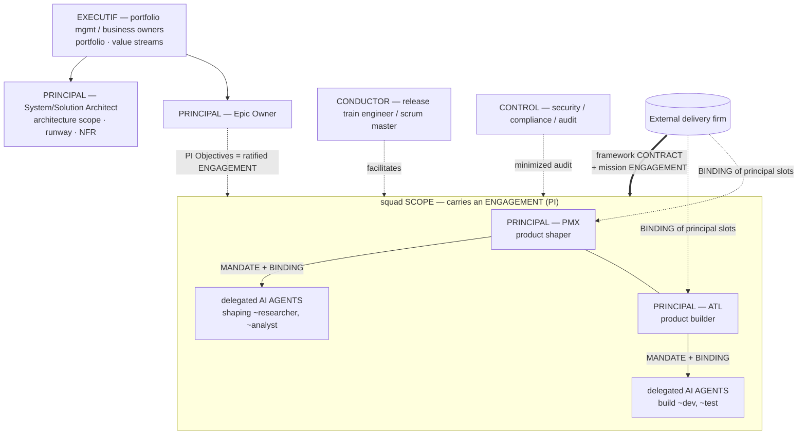

# Use-case E — Agentic-delivery squad with contracted roles

> Topology: **agile train + squads**. [← library](./README.md)

A scaled-agile organization (SAFe-style) that manages a mix of **human roles** and **AI agents**, where some roles are **contracted in** from an external delivery firm. The base squad is a **PMX** (*product shaper*) and an **ATL** (*product builder*), both *builders* of the squad, each augmented by their own delegated AI agents.

> **On PMX / ATL**: these role names appear to be proprietary/internal labels — no public founding document defines them by name (see [References](#references)). They are kept here as the operating model's role names. The underlying pattern (AI-augmented micro-squad; convergence of product + build; "delegate, review, own") is publicly documented.

## Diagram

## Mapping

| Construct (SAFe-style / contracted delivery) | `h2a` mapping | Notes |
|---|---|---|
| Lean Portfolio Mgmt / Business Owners | `EXECUTIF` | Umbrella scope, funds/arbitrates; does not pilot day-to-day. |
| Epic Owner | `PRINCIPAL` (epic/portfolio scope) | Owns an epic's outcome + budget. |
| Product Owner / Product Mgmt (client side) | `PRINCIPAL` (product scope) | When product ownership stays client-side above the squad. |
| **System / Solution / Enterprise Architect** | `PRINCIPAL` (architecture scope) | **Owns** the runway and NFRs (otherwise chaos); `CONTROL` is not the architecture. |
| RTE / Scrum Master / STE | `CONDUCTOR` | Facilitates; does not own the scope. |
| Security / Compliance / Audit | `CONTROL` | Audit, veto, minimized view. |
| **PMX — product shaper** | `PRINCIPAL` (*shaping* facet) | Co-owner of the squad; delegated AI agents. |
| **ATL — product builder** | `PRINCIPAL` (*build* facet) | Co-owner of the squad; delegated AI agents. |
| PMX/ATL's AI agents | mandated `AGENTS` (or `SUBAGENTS`, DEC-068) | Delegated via `MANDATE` + `BINDING` inside the principal's scope. |
| Squad / ART / Solution Train / Value Stream | `SCOPE` (squad → federation) | Durable scope; it *carries* an engagement, it *is not* the engagement. |
| PI / PI Objectives / commitment | `ENGAGEMENT` | Executable mission ratified at PI planning; *has* the train scope. |
| Role filled via external firm | `CONTRACT` framework + `ENGAGEMENT` + `BINDING` | The client contracts the firm; principal slots are bound to firm instances. |
| Guardrails / DoD / NFR / lean budget | `ENGAGEMENT` clauses (default) or standalone `POLICY` | Engagement-centric; standalone `POLICY` reserved for cross-cutting/imposed rules (portfolio). |

## The PMX + ATL squad (core of the model)

- The **squad** is a `SCOPE` carrying an `ENGAGEMENT` (the squad's mission for the current PI).
- **PMX** and **ATL** are **co-`PRINCIPAL`** (multi-human `shared` mode, DEC-042): PMX owns the *product shaping* facet, ATL the *build* facet. Either one shared squad scope with two principals, **or** two sub-scopes (`squad/shaping`, `squad/build`) with one principal each.
- Each principal **delegates its AI agents** as `AGENTS` via an explicit `MANDATE` (`{instance, role, scope, rights}`) + a `BINDING` of the slot to the agent instance. An agent's authority never exceeds its principal's mandate.
- If an AI agent spawns its own sub-agents → the **SUBAGENTS** layer (DEC-068: address `pmx~researcher`, authority consolidated under the parent, audit + revocation per parent).

## Contracting the roles

- A framework `CONTRACT` links the client and the external delivery firm (SLA, confidentiality, IP, audit rights, exit).
- The squad's work is a derived `ENGAGEMENT` (charter, success criteria, duration, journal).
- The **principal slots** PMX/ATL are **bound** to instances provided by the firm → the firm carries **principal-level** responsibility (product + build), not staff augmentation. The client `EXECUTIF`/Epic Owner stays above.
- The same `CONTRACT → ENGAGEMENT → BINDING` scheme covers an AI agent supplied under contract (the instance bound to the slot is an agent instead of a human).

## N-squads case

Several squads (each PMX+ATL+agents) under one train:

- Each squad negotiates its PI `ENGAGEMENT`; the `EXECUTIF` (portfolio) arbitrates the portfolio, not each task.
- Inter-squad escalations target the scope authority (RTE/CONDUCTOR of the train, then EXECUTIF), not a raw stream to the top.
- Common guardrails (DoD, NFR, runway) are owned by the architecture `PRINCIPAL`, referenced as engagement clauses; a blocking conflict escalates (DEC-041, `policy-precedence` `partial`).

## Gaps

- PMX/ATL co-ownership: one scope with two principals vs two sub-scopes — joint-signature rule?
- Standard mandate for a delegated AI agent (rights: usually execution-only, non-signing).
- `AGENTS` mandated vs `SUBAGENTS` (DEC-068) boundary: at what level an agent becomes individually addressable/auditable.
- The contract grants **principal-level** authority to an external provider: which control/exit clauses bound it?
- Guardrails as engagement clauses vs standalone `POLICY`: switch criterion (cross-cutting/imposed ⇒ POLICY).

## Compatibility hypothesis

Holds with the V1 vocabulary: **no new role or artifact**. The scaled-agile + contracted-delivery model maps onto `EXECUTIF`/`PRINCIPAL`/`CONDUCTOR`/`AGENTS`(+`SUBAGENTS`)/`CONTROL`, the `CONTRACT`/`ENGAGEMENT`(/`POLICY`) stack, and the `MANDATE`+`BINDING` pair for agent delegation and role contracting. Watch points: architecture ownership **must** be a `PRINCIPAL` (not only `CONTROL`), and the train/squad is a `SCOPE` distinct from the `ENGAGEMENT` it carries. An executable `D_SAFE` profile (machine-readable, DEC-041) is to be derived from this use-case in a later slice.

## References

No public founding document defines the **PMX**/**ATL** acronyms by name; they appear to be proprietary/internal role labels. The closest public sources for the underlying operating model (AI-augmented micro-squad; product/build convergence; human + agent teams) are listed for context only:

- Sébastien Bourguignon (Sopra Steria Next), *« De la micro-squad augmentée à un modèle opérationnel … à l'ère du SDLC agentique »*, Journal du Net, 2026-04-09 — [journaldunet.com](https://www.journaldunet.com/developpeur/1549427-de-la-micro-squad-augmentee-a-un-modele-operationnel-comment-structurer-les-equipes-produit-a-l-ere-du-sdlc-agentique/)
- Converteo, *AI Product Builder vs PM et Designer* — [converteo.com](https://converteo.com/blog/ai-product-builder-roles-equipe-ia/)
- CIO, *How agentic AI will reshape engineering workflows in 2026* — [cio.com](https://www.cio.com/article/4134741/how-agentic-ai-will-reshape-engineering-workflows-in-2026.html)
