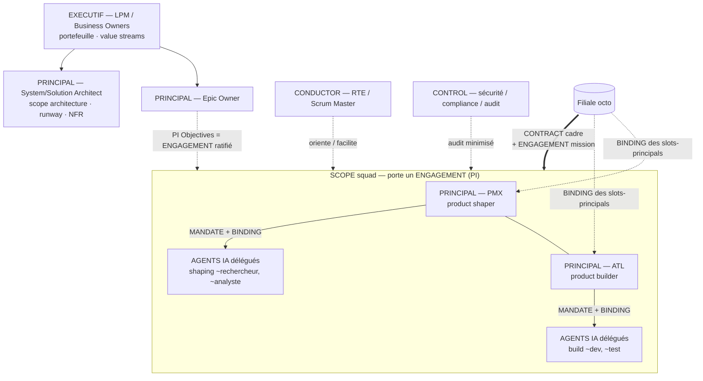

# Use-case E — Organisation SAFe à delivery agentique (modèle octo)

> Topologie : **train agile + squads**. [← librairie](./README.md)

Une organisation **SAFe** (Scaled Agile Framework) où l'on gère un mélange de **rôles humains** et d'**agents IA**, et où certains rôles sont **contractualisés** auprès d'une filiale de delivery (modèle **octo**, filiale innovante d'Accenture). Le squad de base = un **PMX** (*product shaper*) et un **ATL** (*product builder*), tous deux *builders* du squad, chacun augmenté d'agents IA délégués.

## Schéma

## Mapping

| Construct SAFe / octo | Mapping `h2a` | Remarques |
|---|---|---|
| LPM / Business Owners | `EXECUTIF` | Scope d'ensemble, finance/arbitre ; ne pilote pas le quotidien. |
| Epic Owner | `PRINCIPAL` (scope epic/portfolio) | Possède l'outcome d'un epic + budget. |
| Product Owner / Product Mgmt (client) | `PRINCIPAL` (scope produit) | Si l'ownership produit reste côté client au-dessus du squad. |
| **System / Solution / Enterprise Architect** | `PRINCIPAL` (scope architecture) | **Possède** le runway et les NFR (sinon chaos) ; `CONTROL` n'est pas l'archi. |
| RTE / Scrum Master / STE | `CONDUCTOR` | Oriente/facilite ; ne possède pas le scope. |
| Sécurité / Compliance / Audit | `CONTROL` | Audit, veto, vue minimisée. |
| **PMX — product shaper** | `PRINCIPAL` (facette *shaping*) | Co-owner du squad ; agents IA délégués. |
| **ATL — product builder** | `PRINCIPAL` (facette *build*) | Co-owner du squad ; agents IA délégués. |
| Agents IA de PMX/ATL | `AGENTS` mandatés (ou `SUBAGENTS`, DEC-068) | Délégués via `MANDATE` + `BINDING` dans le scope du principal. |
| Squad / ART / Solution Train / Value Stream | `SCOPE` (squad → fédération) | Scope durable ; *porte* un engagement, n'*est* pas l'engagement. |
| PI / PI Objectives / commitment | `ENGAGEMENT` | Mission exécutable ratifiée au PI Planning ; *a* le scope ART. |
| Rôle pourvu via octo | `CONTRACT` cadre + `ENGAGEMENT` + `BINDING` | Le client contractualise octo ; slots-principals bindés à des instances octo. |
| Guardrails / DoD / NFR / lean budget | Clauses d'`ENGAGEMENT` (défaut) ou `POLICY` autonome | Engagement-centric ; `POLICY` autonome réservée au transverse/imposé (LPM). |

## Le squad PMX + ATL (cœur du modèle)

- Le **squad** est un `SCOPE` porté par un `ENGAGEMENT` (la mission du squad pour le PI courant).
- **PMX** et **ATL** sont **co-`PRINCIPAL`** (mode multi-humain `shared`, DEC-042) : PMX la facette *product shaping*, ATL la facette *build*. Un seul scope squad à deux principals, **ou** deux sous-scopes (`squad/shaping`, `squad/build`) avec un principal chacun.
- Chaque principal **délègue ses agents IA** comme `AGENTS` via un `MANDATE` explicite (`{instance, role, scope, rights}`) + un `BINDING` du slot vers l'instance agent. L'autorité de l'agent ne dépasse jamais le mandat de son principal.
- Si un agent IA essaime ses propres sous-agents → couche **SUBAGENTS** (DEC-068 : adresse `pmx~rechercheur`, autorité consolidée sous le parent, audit + révocation par parent).

## Contractualisation des rôles (modèle octo)

- Un `CONTRACT` cadre lie le client et la filiale octo (SLA, confidentialité, IP, audit rights, sortie).
- La prestation du squad est un `ENGAGEMENT` dérivé (charter, critères de succès, durée, journal).
- Les **slots-principals** PMX/ATL sont **bindés** à des instances octo → octo porte une responsabilité **niveau principal** (product + build), pas du staffing. L'`EXECUTIF`/Epic Owner client reste au-dessus.
- Le même schéma `CONTRACT → ENGAGEMENT → BINDING` couvre un agent IA fourni sous contrat (instance bindée au slot = agent au lieu d'humain).

## Cas N squads

Plusieurs squads (chacun PMX+ATL+agents) sous un ART :

- Chaque squad négocie son `ENGAGEMENT` de PI ; l'`EXECUTIF` (LPM) arbitre le portefeuille, pas chaque tâche.
- Escalades inter-squads vers l'autorité de scope (RTE/CONDUCTOR de l'ART, puis EXECUTIF), pas un flux brut au sommet.
- Guardrails communs (DoD, NFR, runway) portés par le `PRINCIPAL` archi, référencés en clauses d'engagement ; conflit bloquant → escalade (DEC-041, `policy-precedence` `partial`).

## Gaps

- Co-propriété PMX/ATL : un seul scope à deux principals vs deux sous-scopes — règle de signature conjointe ?
- Mandat type d'un agent IA délégué (rights : généralement exécution seule, non-signataire).
- Frontière `AGENTS` mandaté vs `SUBAGENTS` (DEC-068) : niveau d'adressabilité/audit individuel.
- Le contrat octo confère une autorité **niveau principal** à un externe : limites/clauses de contrôle et de sortie ?
- Guardrails en clauses d'engagement vs `POLICY` autonome : critère de bascule (transverse/imposé ⇒ POLICY).

## Hypothèse de compatibilité

Tient avec le vocabulaire V1 : **aucun nouveau rôle ni artefact**. SAFe + octo se mappe sur `EXECUTIF`/`PRINCIPAL`/`CONDUCTOR`/`AGENTS`(+`SUBAGENTS`)/`CONTROL`, la pile `CONTRACT`/`ENGAGEMENT`(/`POLICY`), et le couple `MANDATE`+`BINDING` pour la délégation d'agents et la contractualisation des rôles. Vigilance : l'ownership de l'architecture **doit** être un `PRINCIPAL` (pas seulement `CONTROL`), et l'ART/squad est un `SCOPE` distinct de l'`ENGAGEMENT` qu'il porte. Profil exécutable `D_SAFE` (machine-readable, DEC-041) à dériver de ce use-case dans une slice suivante.
