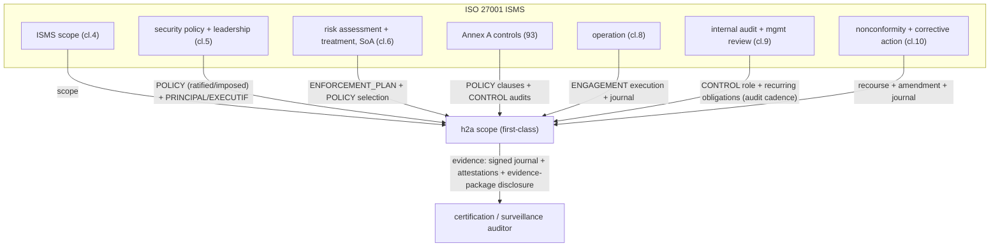

# Evaluation — ISO/IEC 27001 (ISMS) with h2a as the evidence layer

> A *certification* evaluation: model an organization that **achieves ISO/IEC 27001:2022** while **optimizing its use of h2a** — h2a's signed engagements, append-only journal, controlled disclosure and enforcement plans become the very **evidence** the auditor wants. [← library](./README.md) · **Status: draft, pending triple-review** (see [BACKLOG](./BACKLOG.md), item B2).

ISO/IEC 27001 certifies an **Information Security Management System (ISMS)**: clauses 4-10 (context, leadership, planning, support, operation, performance evaluation, improvement) plus **Annex A** controls (2022: 93 controls in 4 themes — organizational, people, physical, technological), governed by a **risk treatment plan** and a **Statement of Applicability (SoA)**. h2a does **not** implement security controls; it is the **management-system spine** that records *who committed to which control under which authority, and proves it* — exactly the auditable trail an ISMS needs.

**Coverage legend** — **✅** = h2a provides a strong primitive the ISMS reuses as-is · **~** = partial / records-but-doesn't-enforce · **✕** = out of scope (the actual security control / physical evidence lives elsewhere).

## Where h2a sits

## Mapping — ISO 27001 → h2a

| ISO 27001 element | h2a construct | Coverage |
|---|---|---|
| ISMS **scope** (cl.4) | first-class `scope` on every role/policy/engagement/trace | ✅ |
| **Security policy** + leadership commitment (cl.5) | `POLICY` (`adoptionMode: ratified` internally, `imposed` for the standard) signed by the `PRINCIPAL`/`EXECUTIF` | ✅ |
| **Risk assessment & treatment**, risk owners (cl.6) | `ENFORCEMENT_PLAN` (verify/detect/escalate) + `POLICY` selecting controls; risk owner = mandated `PRINCIPAL` of the scope | ~ — h2a records the plan + ownership; the risk analysis method is external |
| **Statement of Applicability** (which Annex A controls apply + justification) | a `CONTRACT`/`POLICY` enumerating applicable controls with `sourceAuthority` + justification clauses | ✅ — the SoA is a signed, versioned policy artifact |
| **Annex A controls** (the 93) | each control = a `POLICY` clause (durable rule) + a `CONTROL` audit checking it | ~ — h2a states + audits the control; the technical control itself is implemented out-of-band |
| **Operation** (cl.8) — running the controls | `ENGAGEMENT` execution with charter/roles/journal | ✅ |
| **Monitoring + internal audit** (cl.9.1-9.2) | `CONTROL` role + the append-only journal as evidence + **recurring obligations** (DEC-047) for audit cadence | ✅ |
| **Management review** (cl.9.3) | a recurring `ENGAGEMENT`/journal entry by the `EXECUTIF` | ~ |
| **Nonconformity + corrective action** (cl.10) | `recourse` + `AMENDMENT` + journaled corrective engagement | ✅ |
| **Records / evidence** (pervasive) | append-only, hash-chained, signed journal (DEC-035/073) + signed engagements as **control attestations** | ✅ — this is the standout fit |
| **Auditor access** to evidence | controlled disclosure (DEC-045): `evidence-package` / `attestation` / `redacted-view` | ✅ |

## Contracts vs policies (this model)

- **POLICY** — the ISMS policy, the SoA, and each applicable Annex A control as a durable per-scope rule; `adoptionMode` distinguishes **imposed** (the ISO requirement / regulator), **ratified** (the org's own bylaws), **contractual** (a customer's security clause).
- **CONTRACT** — the framework security contract with a customer/regulator (durable, spawning operational engagements) + the SoA as a signed container.
- **ENGAGEMENT** — operational security work: a remediation project, an access review, an incident response — each with a journal that *is* the audit evidence.
- **ENFORCEMENT_PLAN** — the risk treatment plan: verify control compliance, detect nonconformities, produce evidence, escalate.

## Certification common questions

1. **POLICY vs ENGAGEMENT vs CONTROL** — Annex A controls + the ISMS/SoA policies are **POLICY** (durable rules, `imposed`/`ratified`); running them is **ENGAGEMENT**; internal audit + monitoring is **CONTROL**.
2. **Journal as evidence** — the append-only hash-chained signed journal is the records backbone (cl.7.5 documented information): it proves *who did what, when, under which mandate*. The auditor still needs **out-of-band**: the technical control's actual effectiveness (config, pen-test), physical-security evidence, and people interviews.
3. **Disclosure mode for the auditor** — `evidence-package` (curated proof set) for the certification audit; `attestation` for a control the org vouches for without exposing internals; `redacted-view` for sensitive systems.
4. **Recurring-obligation cadence** — surveillance audits (annual), continuous monitoring (e.g. quarterly access reviews) modelled as recurring obligations (DEC-047).
5. **Nearest built-in profile + delta** — `A_ENTERPRISE` (hierarchical), **plus** (a) an **external AUTHORITY/CONTROL** = the certification body imposing the standard (an external actor imposing a POLICY without being subordinate, the cross-cutting need the README flags), and (b) the SoA policy-set + audit cadence.

## Gaps (honest)

- h2a records and audits **that** a control is in place; it does **not** implement or test the technical control (firewalls, crypto, patching) — that effectiveness evidence is external.
- Physical and people controls (Annex A themes) are largely outside h2a; it holds the *attestations*, not the *acts*.
- The risk-assessment **methodology** (asset valuation, likelihood/impact) is external; h2a stores the resulting treatment plan + ownership, not the analysis.

## Compatibility hypothesis

h2a is an **excellent management-system spine** for ISO 27001: the SoA and Annex A controls map cleanly onto signed, versioned `POLICY` with explicit source-authority and adoption mode; internal audit onto `CONTROL` + recurring obligations; and — the standout — the **append-only signed journal + controlled disclosure** is precisely the auditable, minimally-disclosed evidence trail clauses 7.5 / 9 / 10 demand, with signed engagements doubling as control attestations. The nearest built-in profile is **`A_ENTERPRISE`** plus an **external certification AUTHORITY** that imposes the ISMS policy. h2a does **not** implement the controls themselves — it governs, records, and proves them. No new role or artifact is required.

## References

- ISO/IEC 27001:2022 (ISMS requirements, clauses 4-10) + Annex A (93 controls, 4 themes); ISO/IEC 27002:2022 (control guidance). *(Primary clause citations to be confirmed at triple-review.)*
- h2a primitives: `POLICY` adoption modes (DEC-018), controlled disclosure (DEC-045), recurring obligations (DEC-047), append-only journal (DEC-035), signatures (DEC-073), the A_ENTERPRISE profile (`evaluations/a-enterprise.md`, DEC-041).
