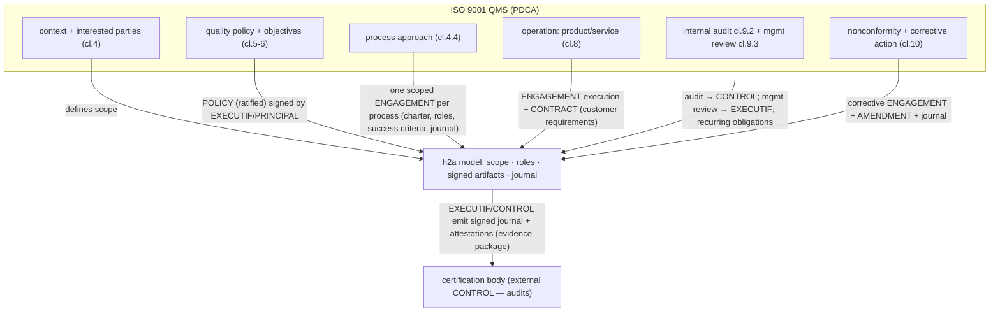

# Evaluation — ISO 9001 (QMS) with h2a as the evidence layer

> A *certification* evaluation: model an organization that **achieves ISO 9001:2015** while **optimizing its use of h2a** — h2a's process engagements, append-only journal, controls and controlled disclosure become the **audit trail** a QMS auditor wants. [← library](./README.md) · **Status: reviewed (2/3)** ([consolidated](./reviews/iso-9001.consolidated.md)) — agy + codex both `revise` → changes applied 2026-05-28; R3 (claude) deferred (timeout).

ISO 9001:2015 **specifies the requirements for** a **Quality Management System (QMS)** (a certification body then certifies conformity) built on the **process approach** + **risk-based thinking** + **PDCA** (Plan-Do-Check-Act), clauses 4-10. h2a does **not** run the processes; it is the **management-system spine** that records *which process committed to which quality objective, who is accountable, and proves conformity* — the documented-information backbone of clause 7.5. This is the sibling of [`iso-27001.md`](./iso-27001.md): same evidence mechanics, different domain (quality vs security).

**Coverage legend** — **✅** = strong primitive the QMS reuses as-is · **~** = records-but-doesn't-perform · **✕** = out of scope (the quality activity itself lives elsewhere).

## Where h2a sits

## Mapping — ISO 9001 → h2a

| ISO 9001 element | h2a construct | Coverage |
|---|---|---|
| QMS **scope** + interested parties (cl.4) | first-class `scope`; interested parties are external actors (only owning/accountable parties are `PRINCIPAL`s) | ✅ |
| **Quality policy** + objectives (cl.5-6) | `POLICY` (`adoptionMode: ratified`) signed by the `EXECUTIF`/`PRINCIPAL`; objectives as policy clauses | ✅ |
| **Process approach** (cl.4.4) — each process with inputs/outputs/owner | one **scoped `ENGAGEMENT`** per process (under the QMS scope): charter, roles, success criteria, journal; process owner = the scope's `PRINCIPAL` (owns it; delegates execution via `MANDATE` to `MANDATAIRE`/`AGENTS`) | ✅ — the standout fit (a process *is* an engagement) |
| **Risk-based thinking** (cl.6.1) | `ENFORCEMENT_PLAN` (what to verify/detect) attached to the engagement | ~ — h2a records the plan; the risk method is external |
| **Customer requirements / contract review** (cl.8.2) | `CONTRACT` with the customer; requirements as clauses; review = a journaled engagement step | ✅ |
| **Operation / production** (cl.8) | `ENGAGEMENT` execution + journal | ~ — h2a journals the operation; production/inspection itself is external |
| **Monitoring (cl.9.1)** | process evidence under the `ENGAGEMENT` / `ENFORCEMENT_PLAN` (metrics produced by the systems) | ~ |
| **Internal audit (cl.9.2)** | `CONTROL` role + journal as evidence + **recurring obligations** (DEC-047) for the audit programme cadence | ✅ |
| **Management review** (cl.9.3) | a recurring `ENGAGEMENT`/journal entry by the `EXECUTIF` | ~ |
| **Nonconformity + corrective action** (cl.10.2) | `recourse` + `AMENDMENT` + a journaled corrective `ENGAGEMENT` (root cause → action → verification) | ✅ |
| **Continual improvement** (cl.10.3) | amendments + recurring review cycles, all journaled | ~ |
| **Documented information** (cl.7.5) | append-only, hash-chained, signed journal (DEC-035/073) — controlled, versioned, tamper-evident | ✅ — exactly the cl.7.5 requirement |
| **Auditor access** | controlled disclosure (DEC-045): `evidence-package` / `attestation` / `redacted-view` | ✅ |

## Contracts vs policies (this model)

- **POLICY** — the quality policy + quality objectives as durable per-scope rules (`ratified`); a customer-imposed quality clause is `contractual`; a regulatory quality requirement is `imposed`.
- **CONTRACT** — the customer contract (requirements, acceptance criteria) spawning operational engagements.
- **ENGAGEMENT** — **each QMS process** (a process *is* a **scoped** operational engagement with an owning `PRINCIPAL`, success criteria, and a journal that is the conformity evidence).
- **ENFORCEMENT_PLAN** — risk-based controls on a process: verify conformity, detect nonconformity, trigger corrective action, escalate to the scope's competent authority (`PRINCIPAL`/`EXECUTIF`).

## Certification common questions

1. **POLICY vs ENGAGEMENT vs CONTROL** — the quality policy/objectives are **POLICY**; each QMS process is an **ENGAGEMENT**; internal audit + monitoring is **CONTROL**.
2. **Journal as evidence** — the append-only signed journal is the cl.7.5 documented information + the cl.9/10 records (audits, nonconformities, corrective actions). The auditor still needs **out-of-band**: product inspection, calibration records, people competence evidence (cl.7.2).
3. **Disclosure mode for the auditor** — `evidence-package` for the audit; `attestation` for a process the org vouches for; `redacted-view` for commercially sensitive customer data.
4. **Recurring-obligation cadence** — the internal audit programme + surveillance audits (annual) + management reviews modelled as recurring obligations (DEC-047).
5. **Nearest built-in profile + delta** — `A_ENTERPRISE`, **plus** the **certification body as an external `CONTROL`** (it audits conformity; it does not impose), the imposing party (a customer/regulator requiring ISO 9001) being an external **`AUTHORITY`**, and the process-as-engagement decomposition.

## Gaps (honest)

- h2a records **that** a process ran and **who** owns it; it does **not** perform the quality activity (inspection, testing, calibration) — that evidence is external.
- Competence/training records (cl.7.2) and the physical product/service are outside h2a; it holds the *attestations*.
- The risk method and quality-objective targets are external; h2a stores the resulting plan + ownership + outcomes.

## Compatibility hypothesis

h2a is a **strong QMS spine**: the **process approach maps one-to-one onto `ENGAGEMENT`** (owner, success criteria, journal), the quality policy onto signed `POLICY`, internal audit onto `CONTROL` + recurring obligations, and corrective action onto `recourse` + `AMENDMENT` — while the **append-only signed journal is precisely the controlled documented information** clauses 7.5 / 9 / 10 demand. As with ISO 27001, h2a governs/records/proves the QMS rather than performing the quality work. Nearest profile **`A_ENTERPRISE`** + the **certification body as external `CONTROL`** (and an external **`AUTHORITY`** where a customer/regulator imposes the requirement). No new role or artifact required.

## References

- ISO 9001:2015 (QMS requirements, clauses 4-10; process approach; PDCA; risk-based thinking). *(Primary clause citations to be confirmed at triple-review.)*
- Sibling evaluation: [`iso-27001.md`](./iso-27001.md) (same evidence mechanics). h2a primitives: `POLICY` (DEC-018), disclosure (DEC-045), recurring obligations (DEC-047), journal (DEC-035), signatures (DEC-073), `A_ENTERPRISE` (DEC-041).
