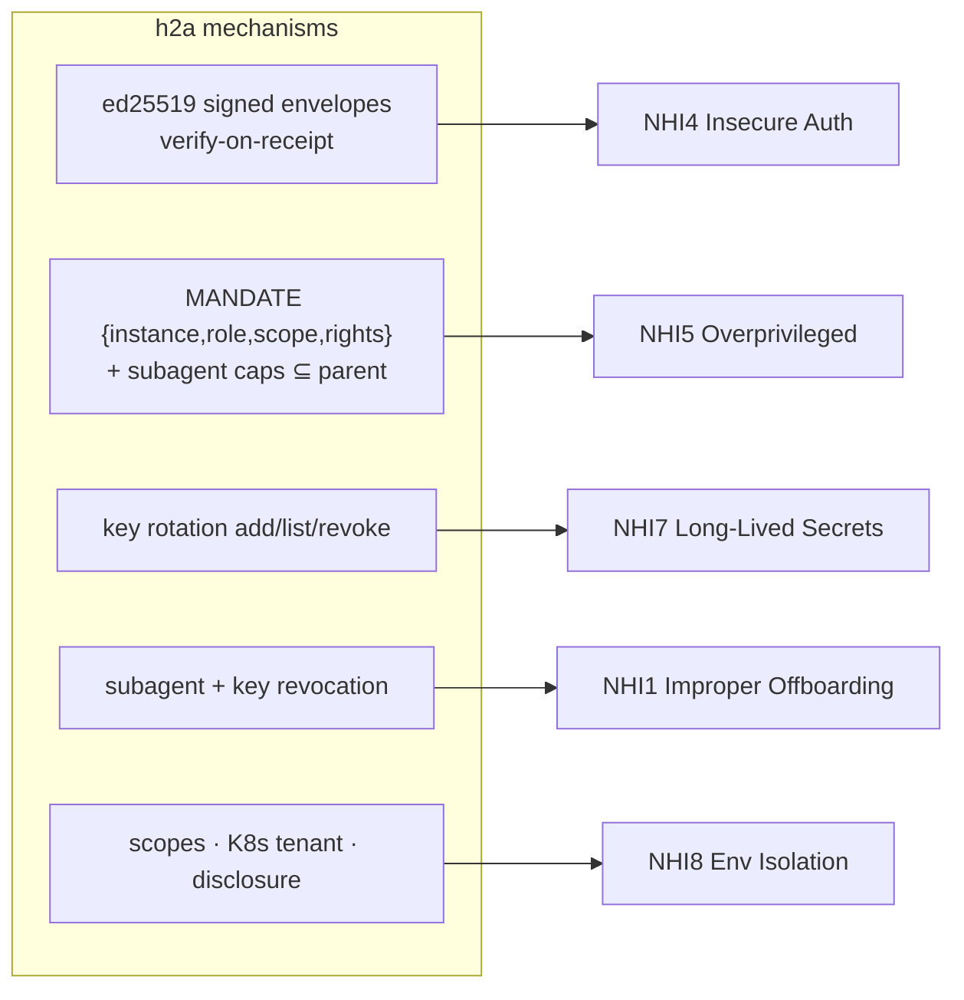

# Complementary evaluation — h2a × Non-Human Identity (OWASP NHI Top 10 / NIST)

> A *complementary* evaluation (not an org track A-E): how `h2a` maps onto **Non-Human Identity (NHI)** security guidance. [← library](./README.md) · **Status: triple-reviewed** · **P1+P2 complete** (`report` DEC-087 · `attest` DEC-088 · `offboard` DEC-089 · `inventory` DEC-090).

Agents, service accounts, API keys and workloads now outnumber human identities (figures cited range from ~10:1 to ~100:1). **Non-Human Identity (NHI)** security is the discipline of authenticating, scoping, rotating and offboarding these machine identities. h2a coordinates **AI-agent** instances — themselves NHIs — so it sits squarely in this space.

## The standards landscape (what to align with)

- **No dedicated NIST NHI standard exists** (as of 2026-05). **NIST SP 800-207** (Zero Trust Architecture) discusses **Non-Person Entities (NPE)** and notes their authentication/audit as a concern in a ZTA, leaving NPE governance largely to the implementation — it is not a prescriptive NHI spec.
- **NIST CSF 2.0** (govern · identify · protect · detect · respond · recover) is the framework an NHI strategy maps to; the new **govern** function is where NHI ownership/accountability lives.
- The concrete, actionable de-facto standard is the **OWASP Non-Human Identities Top 10 (2025)** (endorsed by the Cloud Security Alliance). It ranks the ten most critical NHI risks by exploitability/prevalence/impact.

⇒ h2a aligns with **NIST SP 800-207 / CSF 2.0** at the framing level and maps concretely against the **OWASP NHI Top 10**.

## Where h2a sits

*(The diagram shows representative mechanisms → risk clusters, not all ten risks.)*

## OWASP NHI Top 10 (2025) — h2a coverage

**Coverage legend** — h2a is a **coordination protocol**, so it provides *primitives*, not end-to-end enforcement: **✅** = strong primitive (full prevention still depends on key custody / IAM / deployment outside h2a) · **~** = partial · **✕** = out of scope.

| # | OWASP NHI risk | h2a relevance | Coverage |
|---|---|---|---|
| NHI1 | Improper Offboarding | subagent revocation (DEC-072), key revocation (DEC-079) | ✅ partial — h2a revokes a subagent/key cleanly; full cross-system deprovisioning is out of scope |
| NHI2 | Secret Leakage | envelopes never carry secrets; private keys held out-of-band, only signatures travel (DEC-073) | ~ by design — no secret store; avoids embedding credentials |
| NHI3 | Vulnerable Third-Party NHI | contracted-role model (D_SAFE, DEC-080) + bounded mandates | ~ — mandates bound a third-party agent's blast radius; no software-composition scanning |
| NHI4 | Insecure Authentication | **ed25519 signed envelopes + verify-on-receipt + multi-key** (DEC-073/075/078) | ✅ strong — cryptographic, channel-independent identity proof |
| NHI5 | Overprivileged NHI | **mandate `{instance,role,scope,rights}`**, subagent capabilities ⊆ parent (DEC-068), authority matrix | ✅ strong — least-privilege by construction |
| NHI6 | Insecure Cloud Deployment Config | K8s tenant binds loopback/RWX+lease (DEC-067); `remote serve` 127.0.0.1 default (DEC-077) | ~ partial — secure defaults in the deploy renderers |
| NHI7 | Long-Lived Secrets | **zero-downtime key rotation** add→overlap→revoke (DEC-078/079) | ✅ strong — rotation is first-class |
| NHI8 | Environment Isolation | first-class scopes, K8s namespace tenant, disclosure profiles (DEC-045) | ~ — scope/tenant isolation; not full runtime env isolation |
| NHI9 | NHI Reuse | per-instance identity + per-subagent addressing `parent~name` (DEC-068) + per-key | ✅ partial — distinct addressable identities discourage shared/reused NHIs |
| NHI10 | Human Use of NHIs | role separation (human `PRINCIPAL` vs agent `AGENTS`), mandate = explicit delegation, signed provenance + journal | ~ — provenance records who/what acted; does not by itself prevent a human wielding an NHI key |

## Gaps (honest)

- **Secrets management** (NHI2) and **SCA / third-party vetting** (NHI3) are **out of h2a's scope** — h2a assumes keys are provisioned/stored elsewhere (it consumes ed25519 keys, it is not a vault).
- **Discovery/inventory** of NHIs (a core NHI program need) is partial: h2a's registry lists *its* instances/subagents, not the org's whole machine-identity estate.
- **Human-use prevention** (NHI10) is observational (provenance), not preventive.
- NHI8 isolation is scope/tenant-level, not workload-runtime-level.

## Compatibility hypothesis

h2a offers **strong primitives on the core identity-and-authority axes** the OWASP NHI Top 10 emphasizes — authentication (NHI4), least privilege (NHI5), rotation (NHI7) — because those are exactly what it implements (ed25519 signatures, mandates, keyring). It is **partial** on offboarding (NHI1), reuse (NHI9) and deployment/isolation (NHI6/8) — it gives the revocation/distinct-identity/secure-default mechanisms but not their org-wide enforcement — and **deliberately out of scope** on secrets-management/SCA (NHI2/3). So h2a is best positioned as the **protocol-level agent-identity coordination & provenance layer** within an NHI program, aligned with NIST SP 800-207 / CSF 2.0, **not** as a secrets vault, IAM, or NHI-inventory platform. No new role or artifact is required to claim this coverage.

## Implementation roadmap (paliers)

The target is **a + b + c** — posture/attestation, active lifecycle, interop — delivered incrementally, with **no new component**: everything is CLI verbs under a single `h2a nhi …` group + matching MCP tools, inside the existing 2 packages (1 CLI `h2a`, 1 MCP server which is the API).

| Palier | Surface | What it adds | Reuses |
|---|---|---|---|
| **P1 — posture / attestation / offboard** ✅ | `h2a nhi report` ✅ · `h2a nhi attest` ✅ · `h2a nhi offboard` ✅ (+ `h2a_nhi_report/attest/offboard`) | (1) **report ✅ (DEC-087)**: derive an OWASP-NHI / CSF posture from the registry (auth coverage, overprivileged subagents, key reuse, long-lived keys, offboarding hygiene); (2) **attest ✅ (DEC-088)**: a signed `event` envelope of the posture (verify with `verifyEnvelopeSignature`); (3) **offboard ✅ (DEC-089)**: coordinated decommission (revoke keys + revoke subagents + tombstone; sessions are ephemeral presence, out of scope) | registry/keyring (DEC-078/079), subagents (DEC-072), `signEnvelope` (DEC-073) |
| **P2 — inventory / reuse / TTL** ✅ | `h2a nhi inventory` ✅ (DEC-090) | full machine-identity inventory view, reuse-detection across instances (`sharedWith`), key-age/`longLived` surfacing for rotation planning, offboard state, estate totals | same, extended |
| **P3 — interop** 🟡 | `h2a nhi export` ✅ (DEC-094) + connectors | **slice a ✅**: SPIFFE-trust-bundle export of the keyring (`nhiTrustBundle`/`nhiSpiffeId`, pure core) — the veille's #1 target. Remaining: the `../sentropic/` connector (PEM→JWK, SVID, live Federation endpoint), evidence-feed + secrets-manager targets. Core stays dependency-free. | keyring (DEC-078), attestation envelopes (DEC-088), veille `nhi-landscape.md` |

P1 ships in coherent sub-slices (report first — it is the shared posture model attest and offboard both build on).

## References

- OWASP **Non-Human Identities Top 10 (2025)** — [owasp.org/www-project-non-human-identities-top-10](https://owasp.org/www-project-non-human-identities-top-10/) (endorsed by the CSA: [cloudsecurityalliance.org](https://cloudsecurityalliance.org/blog/2025/06/30/introducing-the-owasp-nhi-top-10-standardizing-non-human-identity-security)).
- NIST **SP 800-207** *Zero Trust Architecture* — flags NPE/NHI as an open challenge.
- NIST **Cybersecurity Framework 2.0** — govern/identify/protect/detect/respond/recover.
