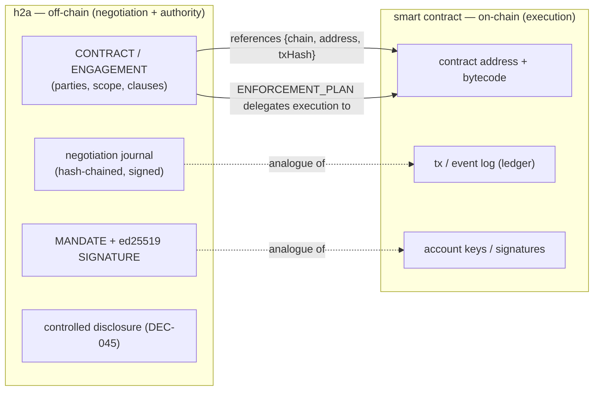

# Complementary evaluation — h2a × smart contracts (blockchain)

> A *complementary* evaluation (not an org track A-E): how `h2a` relates to **on-chain smart contracts**. [← library](./README.md) · **Status: draft, pending triple-review** (see [BACKLOG](./BACKLOG.md), item B4).

h2a and a smart-contract platform both produce **signed, append-only, verifiable commitments** — but at different layers. h2a governs the **human/agent negotiation and authority** that *precedes and surrounds* a commitment; a smart contract is **autonomous on-chain execution** of an agreed rule. They compose: h2a journals *the act of agreeing* (who offered/countered/signed, under which mandate), an on-chain contract executes *the agreed mechanism*. This evaluation maps the concepts and specifies a **reference** (not a bridge that moves value).

**Coverage legend** — h2a is a coordination/governance protocol, not a chain: **✅** = strong conceptual analogue h2a already implements · **~** = partial / relationship only · **✕** = out of scope (stays on-chain or off-chain by design).

## Where h2a sits



*(The diagram shows the reference + the analogues, not a value bridge.)*

## Concept mapping

| h2a concept | Smart-contract analogue | Relationship | Coverage |
|---|---|---|---|
| `CONTRACT` / `ENGAGEMENT` (signed, stabilized) | the deployed contract at an address | h2a holds the *negotiated agreement + authority*; the chain holds the *executable mechanism* the agreement references | ~ — they reference, not duplicate |
| negotiation journal (append-only, hash-chained, DEC-035) | the chain's tx/event ledger | both are tamper-evident ordered logs; h2a's is governance-side (who agreed), the chain's is execution-side (what ran) | ✅ analogue — h2a already has a hash-chained signed journal |
| ed25519 `SIGNATURE` + `MANDATE` (DEC-073/068) | account keypair signatures authorizing a tx | both authenticate the author; h2a additionally binds a *mandate/role/scope* (authority the bare on-chain key lacks) | ✅ — h2a adds the authority layer over the signature |
| `ENFORCEMENT_PLAN` (DEC) | the contract's autonomous code (the "code is law" part) | h2a *plans/audits* enforcement and can delegate the deterministic part to on-chain execution | ~ — h2a verifies/escalates; the chain self-executes |
| terminal states + base hash + stale-proposal rules (negotiation) | nonce / finality / replay protection | both prevent double-spend / stale acceptance; h2a's anti-replay (DEC-074) mirrors nonce/finality | ✅ analogue |
| controlled disclosure (DEC-045: redacted/evidence/hash-only) | public ledger (all data visible) | **opposite defaults** — h2a discloses minimally; a public chain discloses everything. h2a's disclosure modes are what a chain lacks | ~ — complementary, not equivalent |
| human authority / recourse / amendment | (no native concept; governance is bolted on via DAOs/multisig) | h2a's PRINCIPAL/EXECUTIF/recourse/amendment is the off-chain authority a contract can reference | ✕ on-chain — stays in h2a |

## Interop — referencing an on-chain artifact

Mirroring the SysML interop (`sysml-v2.md` §3, where a `CONTRACT` references a model element by `{project, commit, element}`), an h2a artifact can reference an **on-chain artifact** by an immutable triple:

```
H2AChainRef {
  kind: "evm" | "chain";
  chainId: string;     // e.g. "eip155:1"  (CAIP-2)
  address: string;     // contract / account address
  txHash?: string;     // optional: the tx that deployed/triggered it (freezes the state)
  abiHash?: string;    // optional: canonical hash of the ABI/interface
}
```

- Embedded in an `ENGAGEMENT`/`CONTRACT` body as `subject: { chainRef }`, it is ordinary signed content (DEC-035/073): **signing the envelope pins the on-chain referent** — *"I, this mandated actor, commit to the contract at {chain, address}, as of {txHash}"* — without h2a transacting or holding keys.
- Verification has two trust levels, exactly like SysML interop (S3): **(a) commit-trust** — verify the envelope signature + the immutable `{chainId, address, txHash}`; **(b) content-integrity** — an adapter re-reads the on-chain code/ABI via an RPC and checks `abiHash`. The adapter (RPC client) would live in `../sentropic/` connectors, not in core — same boundary as the SPIFFE/NHI-export and SysML-API adapters (core stays chain-free).

## What stays off-chain (by design)

- **Negotiation** — offers/counters/withdrawals before agreement: h2a's journal, never on a public chain.
- **Controlled disclosure** — h2a redacts/attests; a public chain cannot.
- **Human authority, mandate, recourse, amendment** — the PRINCIPAL/EXECUTIF/MANDATAIRE layer; a contract references it, does not replace it.
- **Key custody / value transfer** — h2a never holds chain keys or moves tokens (the auth-boundary invariant, as for the SysML API and NHI vault).

## Gaps (honest)

- h2a does **not** execute on-chain, hold keys, or move value — it references and governs (like the SysML and NHI evaluations: a coordination layer, not a vault/VM).
- The `H2AChainRef` type + a `verifyEnvelopeChainRef` would be a future slice (parallel to SysML S1/S3); **not yet implemented** — this evaluation specifies the mapping, not shipped code.
- On-chain governance frameworks (DAO voting, multisig thresholds) are richer than a single mandate; mapping multi-party on-chain governance to h2a quorum is open.
- Finality/reorg semantics (a `txHash` can be reorged on some chains) weaken the "immutable" assumption vs a SysML commit — `txHash` should carry a confirmations/finality caveat.

## Compatibility hypothesis

h2a is the **off-chain negotiation-and-authority layer** that a smart contract can be *referenced from* and *governed by*: its hash-chained signed journal, ed25519 signatures + mandates, terminal-state/anti-replay rules are direct analogues of a ledger, account signatures and nonce/finality, while its controlled disclosure and human-authority/recourse layers are precisely what a public chain lacks. The clean interop is a **reference** (`H2AChainRef` by `{chainId, address, txHash}`) verified at commit-trust or content-integrity — the same pattern as the SysML and SPIFFE interops, with the RPC adapter living in an external connector so core stays chain-free. h2a is **not** a chain, a wallet, or a VM, and no new role or artifact is required to claim this relationship.

## References

- The h2a primitives this maps onto: signed envelopes (DEC-073), hash-chained journal (DEC-035), anti-replay (DEC-074), mandates (DEC-068), controlled disclosure (DEC-045). Interop precedent: [`sysml-v2.md`](./sysml-v2.md) §3 + `docs/sysml-interop.md` (the `{chain,address,txHash}` ref mirrors `H2ASysmlRef`).
- **CAIP-2** chain id format (`eip155:1`) — Chain Agnostic Improvement Proposals.
- Smart-contract / "code is law" + on-chain governance (DAO/multisig) — general blockchain references (to be expanded with primary sources at triple-review).
