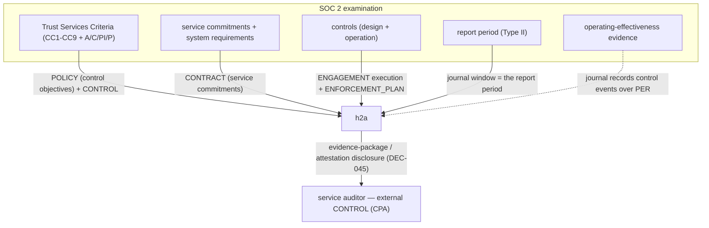

# Evaluation — SOC 2 (Trust Services Criteria) with h2a as the evidence layer

> An *attestation* evaluation: model a service organization that **obtains an unmodified SOC 2 report** while **optimizing its use of h2a** — h2a's append-only signed journal, controls and controlled disclosure become the **signed control-event record** the service auditor (CPA) draws on. [← library](./README.md) · **Status: reviewed (2/3)** — agy + codex both `revise`; changes applied 2026-05-28; R3 (claude) deferred.

SOC 2 (AICPA) reports a service organization's controls against the **Trust Services Criteria (TSC)**: **Security** (the common criteria CC1-CC9, always in scope), plus optionally **Availability**, **Confidentiality**, **Processing Integrity**, **Privacy**. A **Type I** report is a point-in-time design opinion; a **Type II** report opines on **operating effectiveness over a period** (typically 6-12 months). h2a does **not** implement the controls; it is the **management-system spine** whose **time-stamped append-only journal over the report period** is the **signed control-event record** the Type II examination draws on (the CPA's testing renders the effectiveness opinion — h2a does not prove effectiveness itself). Sibling of [`iso-27001.md`](./iso-27001.md) / [`iso-9001.md`](./iso-9001.md).

**Coverage legend** — **✅** = strong primitive reused as-is · **~** = records-but-doesn't-perform · **✕** = out of scope (the control activity / external test lives elsewhere).

## Where h2a sits

## Mapping — SOC 2 → h2a

| SOC 2 element | h2a construct | Coverage |
|---|---|---|
| **Trust Services Criteria** (CC1-CC9 + A/C/PI/P) | each criterion = a `POLICY` clause (control objective) **audited by a `CONTROL`** (h2a records the audit) | ~ — h2a states + records; the technical control is external |
| **Service commitments + system requirements** | a `CONTRACT` with the customer (commitments, SLAs as clauses) | ✅ |
| **Controls** (design + operation) | `ENGAGEMENT` execution + `ENFORCEMENT_PLAN` (verify/detect/escalate) | ~ |
| **Report period** (Type II, operating effectiveness over time) | **the append-only, time-stamped journal window** = the period of operation | ✅ — the standout fit (Type II is *evidence over a period*, which the journal *is*) |
| **Operating-effectiveness evidence** | the signed, time-stamped control-event record across the period (supports the examination; the CPA's testing renders the opinion) | ~ — h2a records the events, does not prove effectiveness |
| **Monitoring / control activities over time** | **recurring obligations** (DEC-047) — the cadence of each control's operation | ✅ |
| **Security (CC)** common criteria | POLICY + CONTROL (overlaps ISO 27001 Annex A) | ~ |
| **Availability / Processing Integrity** | SLA clauses in the `CONTRACT` + monitored engagements | ~ |
| **Confidentiality / Privacy** | controlled disclosure (DEC-045) + data-handling `POLICY`; minimal exposure to the auditor | ~ — disclosure supports evidence-sharing + evidences related controls; it does not by itself satisfy the Privacy/Confidentiality TSC |
| **Auditor (CPA) access** to evidence | `evidence-package` / `attestation` / `redacted-view` (DEC-045) | ✅ |
| **Complementary user-entity controls (CUECs)** | clauses in the customer `CONTRACT` (obligations on the customer side) | ~ |

## Contracts vs policies (this model)

- **POLICY** — the control objectives / TSC mapped to durable per-scope rules; a regulator/framework requirement is `imposed`, the org's own controls `ratified`, a customer security clause `contractual`.
- **CONTRACT** — the service agreement: commitments, SLAs, CUECs, spawning operational engagements.
- **ENGAGEMENT** — the operation of each control over the period, journaled, **scoped to the system under examination** (the SOC 2 system boundary).
- **ENFORCEMENT_PLAN** — how each control is verified/monitored and how exceptions (and CUEC failures) are detected, evidenced, and escalated via `recourse` to the scope's competent authority (`PRINCIPAL`/`EXECUTIF`).

## Attestation / examination common questions

1. **POLICY vs ENGAGEMENT vs CONTROL** — the TSC/control objectives are **POLICY**; operating the controls is **ENGAGEMENT**; monitoring + the audit is **CONTROL**; the customer agreement is **CONTRACT**.
2. **Journal as evidence** — the append-only, hash-chained, signed, time-stamped journal **over the report period** is the signed control-event record the Type II examination draws on: it evidences each control event (*when, by whom, under which mandate*). The CPA's testing renders the operating-effectiveness opinion; the auditor still needs **out-of-band**: technical test results (vuln scans, config), third-party reports, and the controls' actual effectiveness.
3. **Disclosure mode for the auditor** — `evidence-package` for the examination; `attestation` for a control vouched for without exposing internals; `redacted-view` for confidential/PII systems (directly serving the Confidentiality/Privacy criteria).
4. **Recurring-obligation cadence** — each control's operating cadence (daily/weekly/quarterly) + the examination period itself, modelled as recurring obligations (DEC-047); the **report period maps to the journal window**.
5. **Nearest built-in profile + delta** — `A_ENTERPRISE`, **plus** the **service auditor (CPA) as an external `CONTROL`** (examines/opines, not subordinate to the org; does not impose), the imposing party (AICPA framework / customer / regulator) being an external **`AUTHORITY`**, and the period-scoped evidence window.

## Gaps (honest)

- h2a proves controls **operated** (the journal); it does **not** perform or test their **technical effectiveness** — the CPA's testing + third-party reports are external.
- Processing Integrity / Availability evidence (uptime metrics, data-accuracy checks) is produced by the systems, not h2a; h2a holds the attestations/records.
- A SOC 2 report is the **CPA's opinion**; h2a supplies the evidence base, not the opinion.

## Compatibility hypothesis

h2a is a **strong SOC 2 evidence layer**, and the fit is sharpest for **Type II**: the criteria map onto signed `POLICY` audited by a `CONTROL`, control operation onto journaled `ENGAGEMENT` + recurring obligations, and — the standout — the **append-only, time-stamped journal over the report period is the signed control-event record the Type II examination draws on**, with controlled disclosure (`evidence-package`/`attestation`/`redacted-view`) supporting evidence for the Confidentiality and Privacy criteria (not by itself satisfying them). As with the ISO evaluations, h2a governs/records rather than performing the controls or rendering the auditor's opinion. Nearest profile **`A_ENTERPRISE`** + the **service auditor (CPA) as external `CONTROL`**, the imposing party (AICPA framework / customer / regulator) being an external **`AUTHORITY`**. No new role or artifact required. *(With this, Backlog B — smart-contract, ISO 27001, ISO 9001, SOC 2 — is fully drafted; all four await triple-review.)*

## References

- AICPA **Trust Services Criteria** (Security/Availability/Confidentiality/Processing Integrity/Privacy; CC1-CC9); SOC 2 Type I vs Type II. *(Primary citations to be confirmed at triple-review.)*
- Sibling evaluations: [`iso-27001.md`](./iso-27001.md), [`iso-9001.md`](./iso-9001.md). h2a primitives: `POLICY` (DEC-018), disclosure (DEC-045), recurring obligations (DEC-047), append-only journal (DEC-035), signatures (DEC-073), `A_ENTERPRISE` (DEC-041).
