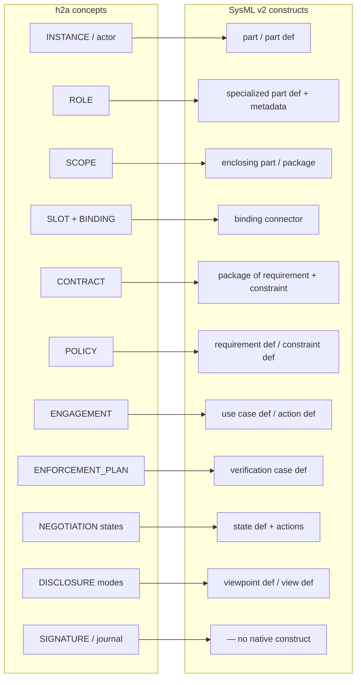
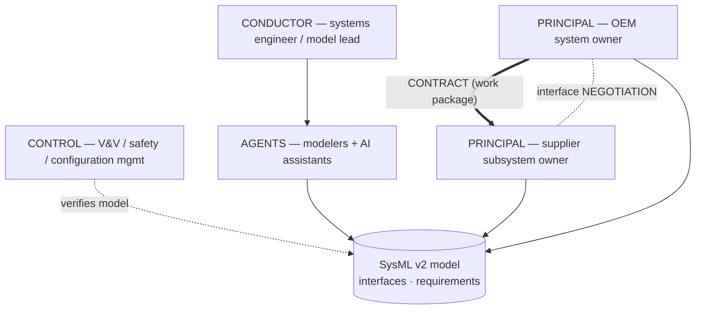
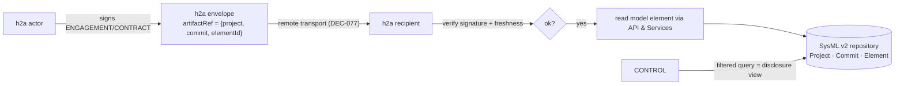

# Complementary evaluation — h2a × SysML v2

> A *complementary* evaluation (not an organizational track A-E): it tests `h2a` against a **formal modeling standard** rather than an org type. [← library](./README.md)

**SysML v2** is the OMG systems-modeling language, successor to SysML 1.x, rebuilt on **KerML** (Kernel Modeling Language) as its semantic foundation. Unlike v1 (a UML profile), v2 has its own metamodel, a **textual notation** alongside the graphical one, formal semantics, and a standardized **Systems Modeling API & Services** (a versioned, git-like model repository: projects, commits, branches, elements, queries). Its hallmark is the **definition / usage** pattern: every concept has a `def` (type) and a `usage` (occurrence) — `part def`/`part`, `requirement def`/`requirement`, `port def`/`port`, etc.

Why evaluate h2a against it: both are **metamodels with serialization**. h2a governs *who may commit/sign what, under which rules*; SysML v2 is *what is being engineered*. The question across four facets: can h2a's governance model be expressed in, layered over, or formalized with SysML v2?

This evaluation has four parts:
1. [Metamodel mapping](#1-metamodel-mapping-h2a--sysml-v2) — concept correspondence.
2. [Use-case: multi-org systems engineering](#2-use-case--multi-org-systems-engineering-governed-by-h2a) — h2a governs SysML v2 deliverables.
3. [Interop / substrate](#3-interop--substrate-over-the-sysml-v2-api--services) — h2a over the SysML v2 API & Services.
4. [Formalizing h2a in SysML v2 / KerML](#4-formalizing-h2a-in-sysml-v2--kerml) — the protocol as a SysML model.

---

## 1. Metamodel mapping (h2a ↔ SysML v2)



| h2a concept | SysML v2 construct | Fit | Note |
|---|---|---|---|
| INSTANCE / actor | `part` (usage of a `part def Actor`) | good | a participant is a typed part. |
| ROLE (`PRINCIPAL`…`MANDATAIRE`) | `part def` specializing `Actor`, or a `metadata def` tag | good | roles as specialization or semantic metadata on the participant. |
| SCOPE | enclosing `part` / `package` (namespace) | good | a scope is a containment boundary; "a scope never signs" matches: a package/part is not an actor. |
| SLOT + BINDING | `part` feature (slot) + **`binding connector`** | **excellent** | SysML v2's `binding connector` (`=`) asserts two features are the same thing — a near-literal match for binding an instance to an engagement slot. |
| CONTRACT | `package`/`part def` aggregating `requirement` + `constraint` + parties | good | a normative container = a typed bundle of requirements/constraints over parties. |
| POLICY | `requirement def` / `constraint def` with a `subject` (the scope) | **excellent** | a durable rule over a scope = a requirement/constraint; `adoptionMode` → `metadata`. |
| ENGAGEMENT | `use case def` / `action def` (subject = scope) | good | the executable mission = behavior with a subject and success criteria as `requirement`. |
| OBLIGATION / RIGHT / CLAUSE | `requirement` (`require`) / permitted feature / `constraint` | good | obligation = required constraint; right = permitted feature. |
| ENFORCEMENT_PLAN | **`verification case def`** | **excellent** | enforcement = verifying that contracts/policies/engagements hold — exactly what verification cases do. |
| NEGOTIATION lifecycle (`draft`…`stabilized`) | **`state def`** + `action` (offer/counter/sign) | **excellent** | the negotiation state machine maps 1:1 to a SysML state machine. |
| DISCLOSURE modes (full/redacted/…) | **`viewpoint def` / `view def` / `rendering`** | **excellent** | a view is a filtered projection of the model for a stakeholder — exactly controlled disclosure (DEC-045). |
| AUTHORITY / stakeholder | `stakeholder`, `concern` | partial | SysML models stakeholders/concerns but not *decision rights*. |
| ESCALATION (advise/decide/alert) | `dependency` / `allocation` to a stakeholder + `action` flow | partial | routing exists; the *authority semantics* do not. |
| MANDATE (delegation of rights) | `allocation` + `metadata` | partial | `allocation` maps one element to another, but it is not *authorization*; rights are not first-class. |
| SIGNATURE / hash / append-only journal | — (none) | **gap** | cryptographic provenance is outside SysML's concern; the closest analogue is the **API & Services commit chain** (see §3). |
| MANDATAIRE (neutral notary) | — (none) | **gap** | no SysML construct for a neutral process actor that presents-but-does-not-judge. |

**Reading**: the *structural and normative* half of h2a maps cleanly — and in several cases elegantly (binding connector, verification case, state machine, viewpoints/views). The *governance/provenance* half (signatures, mandate-as-authorization, the neutral MANDATAIRE, the hash-chained ledger) has **no native SysML v2 construct** — these are exactly the things h2a adds on top of "modeling".

**Conclusion**: SysML v2 can express *what is governed*; h2a adds *the act of governing it* (signed authority, negotiation, enforcement) that SysML deliberately leaves out.

---

## 2. Use-case — multi-org systems engineering governed by h2a

The natural organizational shape where SysML v2 and h2a meet: several organizations/teams co-engineer a system whose **authoritative model lives in SysML v2** (OEM + suppliers, or internal subsystem teams). This is a **B-ecosystem topology** ([b-ecosystem.md](./b-ecosystem.md)) where the negotiated artifacts are engineering deliverables.



| Systems-engineering element | h2a mapping |
|---|---|
| System / model owner (OEM) | `PRINCIPAL` of the system scope |
| Subsystem supplier | `PRINCIPAL` of a subsystem scope (external mini-org) |
| Work-package agreement | `CONTRACT` + derived `ENGAGEMENT` per deliverable |
| **Interface agreement between subsystems** | **`NEGOTIATION`** over a SysML v2 `interface def` → stabilized = signed interface |
| Modeling guidelines / NFR / requirements baseline | `POLICY` (or engagement clauses) referencing SysML `requirement`s |
| V&V / safety / configuration management | `CONTROL` (audits the model via filtered views) |
| Requirement conflict / interface mismatch | `ENFORCEMENT_PLAN` + escalation to scope authority |
| A signed-off model baseline | stabilized artifact whose `artifactHash` pins an exact SysML **commit** (see §3) |

**Why it fits**: systems engineering is exactly a domain where *who agreed to which interface/requirement, when, and under what authority* matters as much as the model itself — and SysML v2 alone records the model, not the governance. h2a supplies the missing governance layer over SE deliverables.

**Gaps**: mapping a SysML `interface def` change to an h2a negotiation subject (granularity: per element? per commit?); representing a multi-party model baseline sign-off as a quorum signature; disclosure of a partial model (a supplier sees only its subsystem view — handled by SysML views, §3).

---

## 3. Interop / substrate over the SysML v2 API & Services

The **Systems Modeling API & Services** is a versioned model repository: `Project` → `Commit` (immutable) → `Branch`/`Tag`, with `Element`/`Relationship` resources and a query API. It is effectively a **git-like, hash-addressed store for model elements** — which lines up with h2a's own design.



Key alignments:

- **Immutability / hash-addressing**: a SysML v2 `Commit` is immutable; an h2a stabilized artifact pins `artifactHash`. An h2a envelope can carry `artifactRef = {project, commitId, elementId}` so a signed ENGAGEMENT references an **exact, frozen** model state — the SysML commit *is* the artifact the signature covers.
- **Journal ↔ commit chain**: h2a's append-only negotiation journal and the API's commit history are the same shape (ordered, immutable, parent-linked). The commit chain can *be* the provenance for the model side; h2a's journal records the *governance* events (offer/counter/sign) that reference those commits.
- **Disclosure ↔ queries/views**: a CONTROL reading a redacted projection = a filtered API query / a SysML `view` — the disclosure mode (DEC-045) selects the query scope.
- **Transport**: the shipped `h2a remote` (signed-bearer, DEC-077) carries envelopes that *reference* model elements; the model bytes stay in the SysML repository, the envelope carries authority + the ref. h2a does not need to move the model — only the signed claim about it.

**Gaps / open**: mapping h2a identities to API & Services auth (the API has its own auth); whether h2a verifies the *content* at `{commit, elementId}` (re-hash the element vs trust the commit id); branch/merge semantics when two negotiations touch the same elements; the API's element-level vs commit-level granularity for `artifactRef`.

---

## 4. Formalizing h2a in SysML v2 / KerML

The reverse direction: express **the h2a metamodel itself** as a SysML v2 library package (`h2a` as a model, not just TypeScript). Sketch:

```
package h2a {
  part def Actor;
  part def Principal :> Actor;   part def Executif :> Actor;
  part def Conductor :> Actor;   part def Agents :> Actor;
  part def Control :> Actor;     part def Mandataire :> Actor;

  part def Scope;                          // never an actor
  requirement def Policy { subject scope : Scope; }   // adoptionMode via metadata
  requirement def Contract { ref parties : Actor[1..*]; }
  use case def Engagement { subject scope : Scope; }
  verification case def EnforcementPlan { subject : Contract; }

  state def NegotiationState {             // draft, proposed, countered, …, stabilized
    state draft; state proposed; /* … */ state stabilized;
  }

  // SLOT/BINDING via a binding connector inside an engagement part:
  part def EngagementSlot { ref filledBy : Actor; }   // bind: slot.filledBy = instance

  viewpoint def DisclosureViewpoint;       // full / redacted / evidence / hash-only
  metadata def AdoptionMode;               // ratified / contractual / imposed / acknowledged
}
```

- **What KerML/SysML v2 gives**: formal, tool-checkable semantics; standard serialization (textual + API); interop with the SE toolchain; a single model that downstream tools can consume.
- **What it cannot capture** (same gaps as §1): ed25519 **signatures**, the hash-chained **journal**, **mandate-as-authorization** (allocation ≠ authorization), and the **neutral MANDATAIRE** process role. These stay in the runtime (`@sentropic/h2a`), not the model.
- **Trade-off**: a SysML v2 formalization is a *parallel artifact* to the TS source of truth — valuable as a **specification/interop view** (e.g., to align with an SE org that thinks in SysML), but it must be kept in sync with `VOCABULARY.md` + the TS types, and it does not replace them.

**Recommendation**: treat a SysML v2 formalization as an **optional published view** of the h2a metamodel for SE-tool interop, *derived from* (not authoritative over) the TypeScript model — never the source of truth, because the governance/crypto half lives outside SysML.

---

## Compatibility hypothesis (synthesis)

- **Structural/normative half** of h2a (actors, scopes, slots/bindings, policies, contracts, engagements, enforcement, negotiation states, disclosure) maps onto SysML v2 — several mappings are excellent (`binding connector`, `verification case`, `state def`, `viewpoint`/`view`).
- **Governance/provenance half** (signature, hash-chained journal, mandate-as-authorization, MANDATAIRE) has **no SysML v2 construct** — it is precisely what h2a adds over a modeling language.
- The most concrete near-term value is **§3 (interop substrate)**: h2a envelopes referencing immutable SysML v2 commits, with the API commit-chain as the model-side provenance and SysML views as the disclosure mechanism — it reuses the shipped signed-bearer transport without moving the model.
- No new h2a role or artifact is required for any of the four facets. A future `D_SYSML`-style executable profile is *not* warranted (this is not an org topology); the interop (§3) would instead be a transport/runtime adapter if pursued.

## References

- OMG **Systems Modeling Language (SysML) v2** specification (OMG `formal/sysml`).
- OMG **Kernel Modeling Language (KerML)** specification — SysML v2's semantic base.
- OMG **Systems Modeling API and Services** — the versioned model-repository PSM.
- Pilot implementation & textual notation: [github.com/Systems-Modeling/SysML-v2-Release](https://github.com/Systems-Modeling/SysML-v2-Release).
